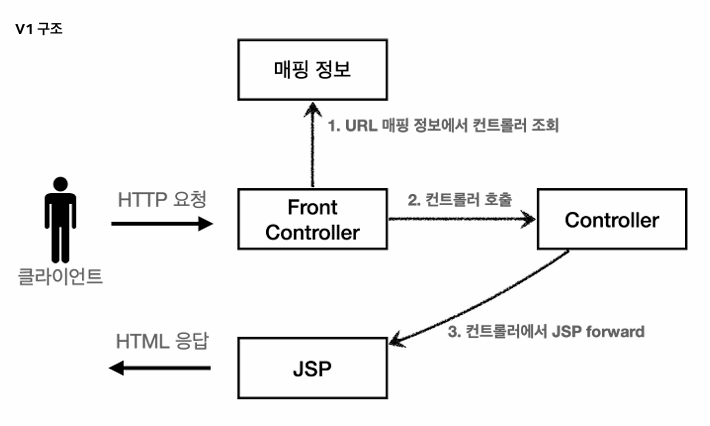
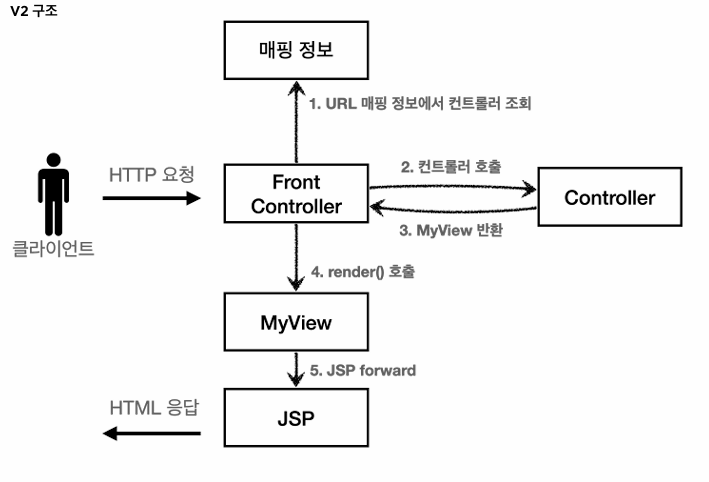
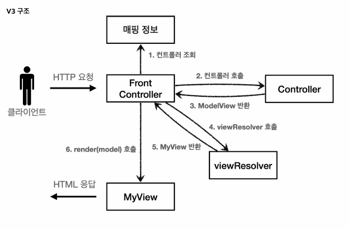
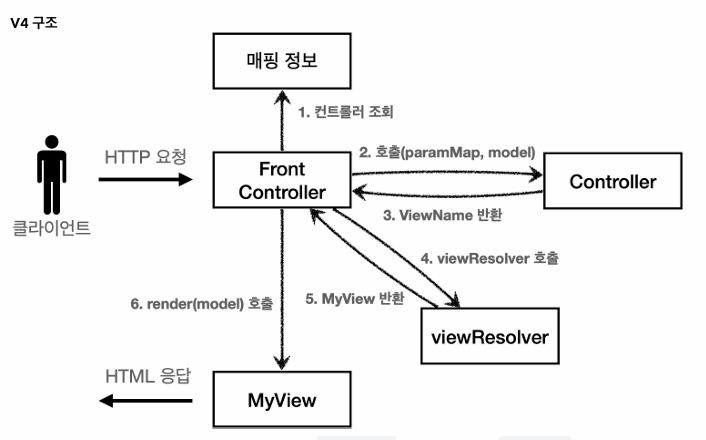
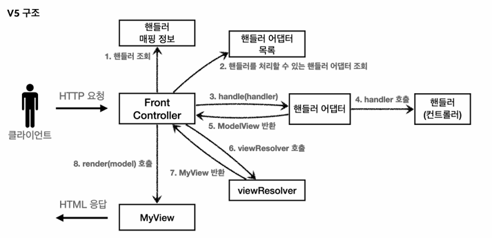

# 수정
# 스프링 MVC 1편 - 백엔드 웹 개발 핵심 기술

- 스프링 MVC: 가장 인기 있는 웹 프레임워크
  
- 백엔드 웹 기술을 학습하기 어려운 이유:
  1. HTTP: 모든 웹 기술은 HTTP 기반이므로 이에 대한 학습되어 있어야 한다.
  2. 20년이나 된 오래된 기술이기 때문이다.
  3. 스프링 MVC는 방대한 양을 학습해야하기 때문이다.

- MVC 프레임 워크를 직접 코드로 개발할 예정
  
- 본 강의에서는 자바 백엔드 기반 기술: MVC 프레임워크, 서블릿, JSP, MVC 패턴, 웹 애플리케이션 이해를 학습할 예정이다.

---
### 웹 애플리케이션 이해
- 웹: HTTP 기반으로 동작, HTTP 메시지에 모든 것을 담아서 전송한다.
  
- 웹 서버: 정적 리소스 제공, 기타 부가 기능 -> 예) NGINX, APACHE
  
- 웹 애플리케이션 서버(WAS): 웹 서버 기능 포함, 프로그램 코드를 실행해서 애플리케이션 로직 수행 -> 예) 톰캣, Jetty, Undertow
  
- 웹 서버, 애플리케이션 서버의 차이는? WAS는 애플리케이션 코드를 실행하는데 더 특화되어 있다!
  
- 웹 시스템 구성? WAS, DB
  
- 서블릿? 개발자가 HTTP 요청/응답 정보를 편리하게 사용할 수 있도록 제공한다.
  
- 서블릿 컨테이너? 
  1. 톰캣처럼 서블릿을 지원하는 WAS를 서블릿 컨테이너라고 한다.
  2. 서블릿 객체를 생성, 초기화, 호출, 종료하는 생명주기 관리
  3. 서블릿 객체는 싱글톤으로 관리, 그러므로 공유 변수 사용 주의
  4. JSP도 서블릿으로 변횐되어서 사용
  5. 동시 요청을 위한 멀티 쓰레드 처리 지원

- 쓰레드?
  - 애플리케이션 코드를 하나하나 순차적으로 실행하는 것이 쓰레드이다. 한번에 하나의 코드 라인만 수행하므로 동시 처리가 필요하면 쓰레드를 추가 생성해야 한다.

- 요청마다 쓰레드를 생성하게 될 때의 장단점?
    - 장점: 리소스가 허용할 때가지 동시 요청 처리 가능, 하나의 쓰레드가 지연되어도 나머지 쓰레드는 정상 동작
    - 단점: 쓰레드는 생성 비용이 매우 비싸고 컨텍스트 스위칭 비용이 발생한다. 생성이 제한되어 있지 않다면 서버가 죽을 수도 있다.
 
- 쓰레드 풀
  - 쓰레드를 쓰레드 풀에 보관하고 관리한다. 생성 가능한 쓰레드의 최대치를 관리하고 톰캣은 최대 200개로 기본 설정되어 있다.
  - 비용이 절약되고 응답 시간이 빨라지며 기존 요청을 안전하게 처리할 수 있는 장점이 있다.
  - WAS의 쓰레드 풀 주요 튜닝 포인트는 최대 쓰레드 수이다. 적절하게~! 애플리케이션 로직의 복잡도, CPU, 메모리, IO 리소스 상황에 따라 모두 다르므로 성능테스트를 시도하여  설정할 수 있도록~!
 
- WAS의 멀티 쓰레드 지원:
  - 멀티 쓰레드에 대한 부분은 WAS가 처리해주므로 개발자가 신경쓰지 않아도 된다. 싱글 쓰레드 프로그래밍을 하듯이 편리하게 소스 코드를 개발할 수 있다.

- 정적 리소스
  - 고정된 HTML 파일, CSS, JS, 이미지, 영상 등을 제공
  - 주로 웹 브라우저
 
- HTML 페이지
  - WAS가 동적으로 필요한 HTML 파일을 생성해서 전달
  - 웹 브라우저는 HTML 해석

- HTML API - 다양한 시스템 연동
  - HTML이 아닌 데이터를 전달, 주로 JSON 활용
  - 데이터만 주고 받고 화면이 필요하면 클라이언트가 별도로 처리
  - 앱, 웹 클라이언트, 서버 to 서버
 
- 서버 사이드 렌더링 - SSR
  - 서버에서 최종 HTML을 생성해서 클라이언트에 전달: JSP, 타임리프
  - 주로 정적인 화면에 사용

- 클라이언트 사이드 렌더링 - CSR
  - HTML 결과를 자바스크립트를 사용해 웹 브라우저에서 동적으로 생성해서 적용: React, Vue.js 
  - 주로 동적인 화면에 사용

- 백엔드 개발자는 어디까지 알아야 하나?
  - 백엔드 개발자의 웹 프론트엔드 기술 학습은 옵션
  - 백엔드 개발자는 서버, DB, 인프라 등등 수 많은 백엔드 기술을 공부해야 한다.
 
- 자바 백엔드 웹 기술의 역사(순서대로)
  - 서블릿(1997): HTML 생성이 어려움
  - JSP(1999): HTML 생성은 편리하지만, 비즈니스 로직까지 너무 많은 역할을 담당
  - 서블릿, JSP 조합 MVC 패턴 사용: 모델, 뷰, 컨트롤러로 역할을 나누어 개발
  - MVC 프레임워크 춘추전국 시대
  - 애노테이션 기반의  스프링 MVC 등장: MVC 프레임워크의 춘추 전국 시대 마무리
  - **스프링 부트의 등장**: 스프링 부트는 서버를 내장 -> 빌드 배포 단순화
  - 스프링 웹 기술의 분화(최신 기술): Web Servlet - Spring MVC / Web Reactive - Spring WebFlux
  - 스프링 웹 플럭스: 비동기 논 블로킹 처리, 최소 쓰레드로 최대 성능, 함수형 스타일로 개발, 서블릿 기술 사용 X, 기술적 난이도가 매우 높음, 아직 RDB 지원 부족, 일반 MVC의 쓰레드 모델도 추분히 빠르기 때문에 아직은 실무에서 많이 사용하지는 않는다.

- 자바 뷰 템플릿의 역사
  - JSP: 속도 느림, 기능 부족
  - 프리마커(Freemarker), 벨로시티(Velocity): 속도 문제 해결, 다양한 기능
  - 타임리프(Thymeleaf): 네추럴 템플릿(HTML의 모양을 유지하면서 뷰 템플릿 적용 가능), 스프링 MVC와 강력한 기능 통합, **최선의 선택!**

---
### 서블릿

- Hello 서블릿
  - 서블릿은 톰캣 같은 웹 애플리케이션 서버를 직접 설치하고, 그 위에 서블릿 코드를 클래스 파일로 빌드해서 올린 다음, 톰캣 서버를 실행하면 된다. 하지만 이 과정은 매우 번거롭다.
  - 스프링 부트는 톰캣 서버를 내장하고 있으므로, 별도의 설치 없이 편리하게 서블릿 코드를 실행할 수 있다.
  - `@ServletComponentScan` 을 사용하여 서블릿을 직접 등록해서 사용할 수 있도록 한다.
  - `@WebServlet`: 서블릿 애노테이션, name: 서블릿 이름, urlPatterns: URL 매핑

- HttpServletRequest
  - HTTPServletRequest의 역할: 서블릿은 개발자가 HTTP 요청 메시지를 편리하게 사용할 수 있도록 개발자 대신에 HTTP 요청 메시지를 파싱한다. 그 결과를 해당 객체에 담아서 제공한다.
  - START LINE: HTTP 메소드, URL, 쿼리 스트링, 스키마, 프로토콜
  - 헤더: 헤더 조회
  - 바디: form 파라미터 형식 조회, message body 데이터 직접 조회
  - 임시 저장소 기능: 해당 요청이 시작부터 끝날 때까지 유지되는 임시 저장소 기능
  - 세션 관리 기능
      
- HTTP 요청 데이터
  - GET - 쿼리 파라미터: 메시지 바디 없이 URL의 쿼리 파라미터에 데이터를 포함해서 전달
  - POST - HTML Form: 메시지 바디에 쿼리 파라미터 형식으로 전달
  - HTTP message body: message body에 데이터를 직접 담아서 요청, 주로 JSON 형식
 
- HttpServletResponse
  - HttpServletResponse의 역할: HTTP 응답 메시지 생성: HTTP 응답코드 지정, 헤더 생성, 바디 생성 / 편의 기능 제공: Content-Type, 쿠키, Redirect

- HTTP 응답 데이터
  - 단순 텍스트, HTML
  - API JSON

---
### 서블릿, JSP, MVC 패턴

- MVC 패턴 - 개요
  - 너무 많은 역할: 하나의  서블릿이나 JSP만으로 비지니스 로직과 뷰 렌더링까지 모두 처리하게 되면 너무 많은 역할을 하게 되고 결과적으로 유지보수가 어려워진다.
  - 변경의 라이프 사이클: UI를 일부 수정하는 일과 비즈니스 로직을 수정하는 일은 각각 다르게 발생할 가능성이 매우 높고 대부분 서로 영향을 주지 않는다. 라이프 사이클이 서로 다른 부분을 하나의 코드로 관리하는 것은 유지보수하기 좋지 않다.
  - 기능 특화: JSP 같은 뷰 템플릿은 화면을 렌더링 하는데 최적화 되어 있기 때문에 이부분의 업무만 담당하는 것이 효과적이다.
  - Model View Controller: MVC 패턴은 하나의 서블릿이나, JSP로 처리하던 것을 컨트롤러와 뷰라는 영역으로 서로 역할을 나눈 것을 말한다.
 
- MVC 패턴 - 한계
  - MVC 컨트롤러의 단점: 포워드 중복, viewPath에 중복, 사용하지 않는 코드, 공통 처리가 어려움 등이 있다.
  - 위 문제를 해결하려면 컨트롤러 호출 전에 먼저 공통 기능을 처리해야 하는데, 프론트 컨트롤러(Front Controller) 패턴을 도입하면 이런 문제를 깔끔하게 해결할 수 있다.
 
---
### MVC 프레임워크 만들기

- 프론트 컨트롤러 패턴 특징
  - 프론트 컨트롤러가 서블릿 하나로 클라이언트의 요청을 받음
  - 프론트 컨트롤러가 요청에 맞는 컨트롤러를 찾아서 호출
  - 입구를 하나로!
  - 공통 처리 가능!
  - 프론트 컨트롤러를 제외한 나머지 컨트롤러는 서블릿을 사용하지 않아도 됨

- 스프링 웹 MVC 와 프론트 컨트롤러
  - 스프링 웹 MVC의 핵심도 바로 FrontController이다.
  - DispatcherServlet이 FrontController 패턴으로 구현되어 있다!
 
- 정리
  - V1: 프론트 컨트롤러 도입
    - 기존 구조를 최대한 유지하면서 프론트 컨트롤러 도입
    -  
  - V2: View 분류
    - 단순 반복 되는 뷰 로직 분리
    - 
  - V3: Model 추가
    - 서블릿 종속성 제거, 뷰 이름 중복 제거
    - 
  - V4: 단순하고 실용적인 컨트롤러
    - 구현 입장에서 ModelView를 직접 생성해서 반환하지 않도록 편리한 인터페이스 제공
    - 
  - V5: 유연한 컨트롤러
    - 어댑터 도입, 프레임워크를 유연하고 확장성 있게 설계
    - 핸들러 어댑터: 다양한 종류의 컨트롤러를 호출할 수 있게 한다.
    - 핸들러: 어떤한 것이든 해당하는 종류의 어댑터만 있으면 처리할 수 있게 된다.
    - 

  ---
### 정리

위에서 스프링 MVC의 핵심 구조를 파악하는데 필요한 부분을 모두 만들어보았다.
V5의 구조가 우리가 배우고자 하는 스프링 MVC와 동일한 형태라고 볼 수 있다고 한다.

다음 내용을 통해서 직접 스프링 MVC의 기본 기능들을 학습해보도록 하겠다.
  
