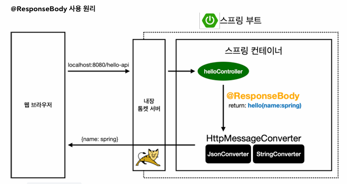
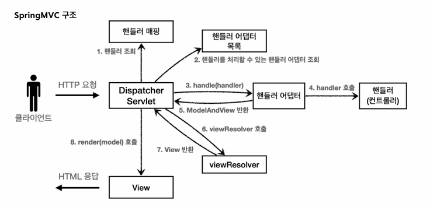
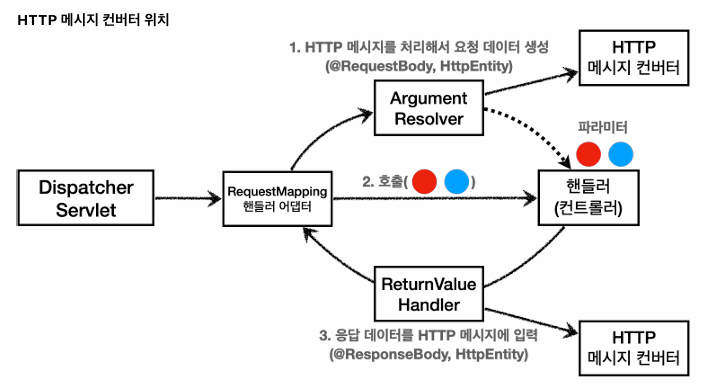

# 수정
# 스프링 MVC 1편 - 백엔드 웹 개발 핵심 기술

## 스프링 MVC - 기본 기능!

### - 로깅 간단히 알아보기

운영 시스템에서는 System.out.println() 같은 시스템 콘솔을 사용해서 필요한 정보를 출력하지 않고 별도의 로깅 라이브러리를 사용해서 로그를 출력한다.

로깅 라이브러리: 스프링 부트 라이브러리를 사용하면 스프링 부터 로킹 라이브러리(spring-boot-starter-logging)가 함께 포함되어 있다고 한다.
로그 라이브러리는 Logback, Log4J, Log4J2 등등 수 많은 라이브러리가 있지만 그것을 통합한 인터페이스를 제공하는 것이 바로 SLF4J 라이브러리이다.
SLF4J는 인터페이스이고, 그 구현체로 Logback 같은 라이브러리를 선택해서 사용하는데 실무에서는 대부분 스프링 부트가 기본으로 제공하는 Logback을 사용한다.

- 로그 사용 예시
```java
private Logger log = LoggerFactory.getLogger(getClass());

String name = "Spring";

log.trace("trace log={}", name);
log.debug("debug log={}", name);
log.info(" info log={}", name);
log.warn(" warn log={}", name);
log.error("error log={}", name);
/*위에서 아래의 순서로 레벨이 높다.
* 개발 서버는 debug 출력, 운영 서버는 info 출력이 일반적이다.
 */
```

---
### - 요청 매핑

- @RestController
  - @Controller는 반환 값이 String이면 뷰 이름으로 인식된다. 그래서 뷰를 찾고 뷰가 렌더링되지만 @RestController는 반환 값으로 뷰를 찾는 것이 아니라, HTTP 메시지 바디에 바로 입력한다.

- @RequestMapping
  - 해당하는 URL 호출이 오면 이 메서드가 실행되도록 매핑한다.
  - method를 지정하여 특정 HTTP 메서드 요청만 허용하도록 할 수 있다.

- HTTP 메서드 매핑 축약
  * @GetMapping
  * @PostMapping
  * @PutMapping
  * @DeleteMapping
  * @PatchMapping

- @PathVariable
  - @PathVariable을 사용하면 매칭 되는 부분을 편리하게 조회할 수 있다.
  - @GetMapping("/mapping/{pathVariable}) -> (@PathVariable(pathVariable) String data)
  - @PathVariable("userId") String userId -> @PathVariable String userId

- 특정 파라미터 조건 매핑
- 특정 헤더 조건 매핑
- 특정 미디어 타입 조건 매핑

---
### - HTTP 요청 파라미터 - 쿼리 파라미터, HTLM Form

클라이언트에서 서버로 요청 데이터를 전달할 때는 주로 다음 3가지 방법을 사용한다.

1. GET - 쿼리 파라미터
2. POST - HTML Form
3. HTTP message body

GET 쿼리 파리미터 전송 방식이든, POST HTML Form 전송 방식이든 둘다 형식이 같으므로 구분없이 조회할 수 있다.

이것을 간단히 요청 파라미터(request parameter) 조회라 한다.

- request.getParameter()
  - 단순하게 HttpServletRequest가 제공하는 방식으로 

***Tip. 리소스는 /resource/static 아래에 두면 스프링 부트가 자동으로 인식한다.**

***Tip. Jar를 방식을 사용하면 webapp 경로를 사용할 수 없다. 정적 리소스도 클래스 경로에 함께 포함해야한다.**

---
### - HTTP 요청 파라미터 - @RequestParam

- @RequestParam: 파라미터 이름으로 바인딩한다.
  - @RequestParam("username") String memberName -> request.getParameter("username")
  - String, int, Integer 등의 단순 타입이면 @RequestParam 생략 가능하다.
  - 애노테이션을 생략하면 스프링 MVC 내부에서 required=false를 적용한다.
  - defaultValue를 사용하면 기본 값을 적용할 수 있다.
  - 파라미터를 Map으로 조회할 수도 있다. -> @RequestParam Map<String, Object> paramMap

- @ResponseBody: View 조회를 무시하고, HTTP message body에 직접 해당 내용 입력한다.

---
### HTTP 요청 파라미터 - @ModelAttribute

실제 개발을 하다보면 요청 파라미터를 받아서 필요한 객체를 만들고 그 객체에 값을 넣어주어야 한다.

스프링은 이 과정을 완전히 자동화해주는 @ModelAttribute 기능을 제공한다.

(@ModelAttribute CustomData customData) 이런 경우, 스프링 MVC는 다음과 같은 동작을 한다.
1. CustomData 객체를 생성한다.
2. 요청 파라미터의 이름으로 CustomData 객체의 프로퍼티를 찾는다. 해당 프로퍼티의 setter를 호출해서 파라미터 값을 바인딩한다.

@ModelAttribute는 생략할 수 있지만 @RequestParam과 혼란이 발생할 수도 있다.

스프링은 해당 생략시 다음과 같은 규칙을 적용한다.
- String, int, Integer 같은 단순 타입은 @RequestParam
- 나머지는 @ModelAttribute (argument resolver로 지정해둔 타입 외)

---
### HTTP 요청 메시지 - 단순 텍스트

요청 파라미터와 다르게, HTTP 메시지 바디를 통해서 데이터가 직접 넘어오는 경우는 @RequestParam, @ModelAttribute를 사용할 수 없다.

HTTP 메시지 바디의 데이터는 다양한 방법으로 읽을 수 있다.
1. request.getInputStream()
2. 파라미터에 InputStream inputStream(HTTP 요청 메시지 바디의 내용을 직접 조회)을 지원한다. OutputStream(HTTP 응답 메시지의 바디에 직접 결과 출력) 도 지원한다.
3. HTTPEntity 파라미터를 통해 HTTP header, body 정보를 편리하게 조회할 수 있다. 응답에도 사용 가능하다.
4. **@RequestBody 애노테이션**을 사용하면 HTTP 메시지 바디 정보를 편리하게 조회할 수 있다. 추가적으로 @ResponseBody 도 존재하는데 응답 결과를 HTTP 메시지 바디에 직접 담아서 전달할 수 있다.

---
### HTTP 요청 메시지 - JSON

HTTP API에서 주로 사용하는 JSON 데이터 형식을 조회할 때 사용하는 방식이 있다.

1. request.getInputStream()
2. @RequestBody -> HttpMessageConverter 사용
3. 파라미터 타입을 원하는 객체로 지정하면 @ModelAttribute처럼 한번에 객체로 변환하여 사용할 수 있다. 단, @RequestBody는 생략할 수 없다.
4. HTTPEntity 파라미터도 지원한다.


---
### HTTP 응답 - 정적 리소스, 뷰 템플릿

서버에서 응답 데이터를 만드는 방법은 크게 3가지이다.

1. 정적 리소스: 웹 브라우저에 정적인 HTML, css, js를 제공할 때는 정적 리소스를 사용한다.
2. 뷰 템플릿: 웹 브라우저에 동적인 HTML을 제공할 때는 뷰 템플릿을 사용한다.
3. HTTP 메시지 사용:  HTTP API를 제공하는 경우에 HTML이 아니라 데이터를 전달해야 하므로, HTTP 메시지 바디에 JSON과 같은 형식으로 데이터를 보낸다.

- 정적 리소스
  - 스프링 부트는 클래스패스의 다음 디렉토리에 있는 정적 리소스를 제공한다. /static, /public, /resources, /META-INF/resources

- 뷰 템플릿
  - 뷰 템플릿을 거쳐서 HTML이 생성되고, 뷰가 응답을 만들어서 전달한다.
  - 스프링 부트는 기본 뷰 템플릿 경로를 제공한다. src/main/resources/templates

---
### HTTP 응답 - HTTP API, 메시지 바디에 직접 입력

HTTP API를 제공하는 경우에는 HTML이 아니라 데이터를 전달해야 하므로, HTTP 메시지 바디에 JSON 같은 형식으로 데이터를 실어 보낸다.

1. HTTPServletResponse 객체를 통해서 응답 메시지를 전달한다. -> response.getWriter().write("ok")
2. ResponseEntity 엔티디로 전달한다.
3. @ResponseBody를 통해서 전달한다.

---
### HTTP 메시지 컨버터

뷰 템플릿으로 HTML을 생성해서 응답하는 것이 아니라, HTTP API처럼 JSON 데이터를 HTTP 메시지 바디에서 직접 읽거나 쓰는 경우 HTTP 메시지 컨버터를 사용하면 편리하다.

사용 예시는 다음과 같다.



스프링 MVC는 다음과 같은 경우에 HTTP 메시지 컨버터가 적용된다.
- HTTP 요청: @RequestBody, HttpEntity(RequestEntity)
- HTTP 응답: @ResponseBody, HttpEntity(ResponseEntity)

---
### 요청 매핑 핸들러 어댑터 구조

그렇다면 HTTP 메시지 컨버터는 스프링 MVC의 어디쯤에서 사용되는 것일까?



모든 비밀은 애노테이션 기반의 컨트롤러, @RequestMapping을 처리하는 핸들러 어댑터인 RequestMappingHandlerAdapter에 있다.

- RequestMappingHandlerAdapter 동작 방식
  1. 컨트롤러 파라미터, 애노테이션 정보를 기반으로 전달 데이터 생성(Argument Resolver)
  2. 호출
  3. 컨트롤러 반환 값을 변환(ReturnValue Handler)

- ArgumentResolver
  - 애노테이션 기반의 컨트롤러는 매우 다양한 파라미터를 사용할 수 있다.
  - HttpServletRequest, Model, @RequestParam, @ModelAttribute, @RequestBody, HttpEntity 등을 지원한다.
  - 이때 ArgumentResolver를 호출해서 컨트롤러가 필요로 하는 다양한 파라미터의 값을 생성한다.
  - supportParameter()를 호출해서 해당 파라미터를 지원하지는지 체크하고 resolveArgument()를 호출해서 실제 객체를 생성한다.

- ReturnValueHandler
  - HandlerMethodReturnValueHandler를 줄여서 위와 같이 부른다.
  - ArgumentResolver와 비슷하게 응답 값을 변환하고 처리한다.
  - ModelAndView, @ResponseBody, HttpEntity, String 등을 지원한다.



HTTP 메시지 컨버터는 위의 위치에 존재한다.

**요청과 응답 시 사용되는 ArgumentResolver와 ReturnValueHandler에서 HTTP 메시지 컨버터를 호출해서 결과를 만든다!**

스프링은 설명한 기능들을 모두 인터페이스로 제공하기 때문에 필요하다면 언제든지 기능을 확장할 수도 있다는 장점이 있다.

실제로 자주 사용하지는 않으니 실제 기능 확장이 필요할 때는 `WebMvcConfigur`을 검색해보도록 하자.
