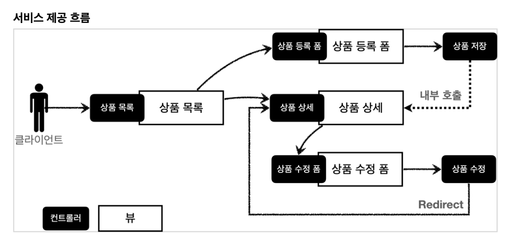
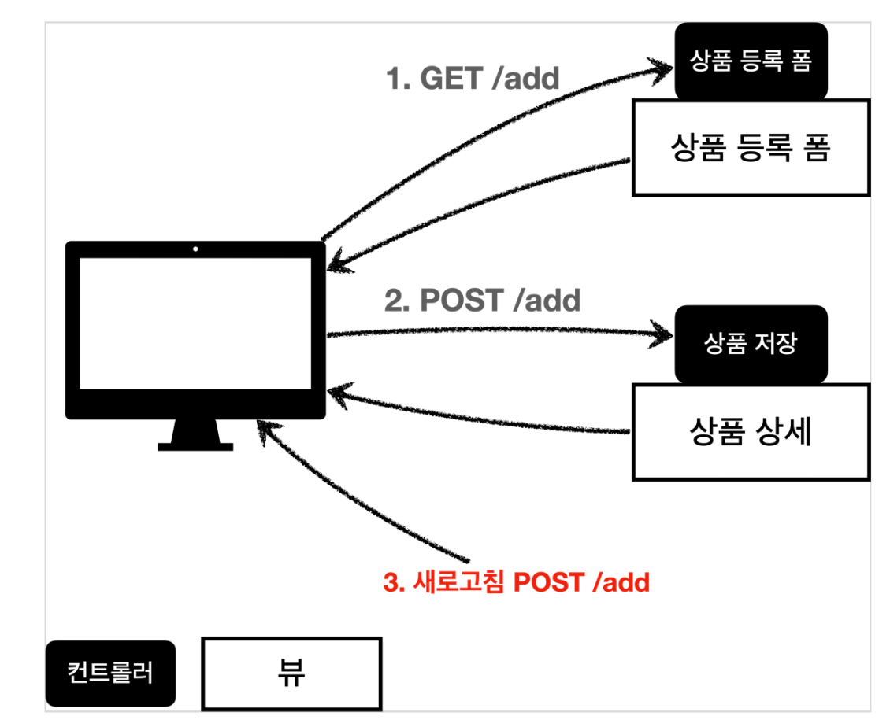

# 수정
# spring_mvc_part1_3

## 웹 페이지 만들기

### 요구사항 분석

상품을 관리할 수 있는 서비스를 만들어보자.

- 상품 도메인 모델
    - 상품 ID
    - 상품명
    - 가격
    - 수량

- 상품 관리 기능
    - 상품 목록
    - 상품 상세
    - 상품 등록
    - 상품 수정



---
### 상품 도메인 개발

- Item: 상품 객체
- ItemRepository: 상품 저장소

---
### 상품 서비스 HTML

- 부트스트랩
  - 웹 사이트를 쉽게 만들 수 있게 도와주는 HTML, CSS, JS 프레임 워크이다.
  - 하나의 CSS로 핸드폰, 태블릿. 데스크탑까지 다양한 기기에서 작동한다.

- 정적 리소스는 /resources/static 에 넣어두면 스프링 부트가 정적 리소스를 제공한다.

### PRG Post/Redirect/Get



위와 같은 흐름이라면 웹 브라우저의 새로 고침은 마지막 서버에 전송한 데이터를 다시 전송한다.

그러면 내용은 같고 ID만 다른 상품 데이터가 계속 쌓이게 된다.

이 문제를 해결하기 위해서 POST -> Redirect -> GET 방식을 사용해야 한다.


새로고침 문제를 해결하려면 위와 같이 상품 저장 후에 뷰 템플릿으로 이동하는 것이 아니라, 상품 상세 화면으로 리다이렉트로 호출을 해주면 된다.

이러면 새로고침을 해도 상품 상세 화면으로 이동하게 되므로 새로고침 문제를 해결할 수 있다.

#### RedirectAttributes

```java
  @PostMapping("/add")
  public String addItem(Item item, RedirectAttributes redirectAttributes) {
    Item Item savedItem = itemRepository.save(item);
    redirectAttributes.addAttribute("itemId", savedItem.getId());
    redirectAttributes.addAttribute("status", true);
    return "redirect:/basic/items/{itemId}";
    }
```

리다이렉트를 할 때 간단히 status=true를 추가한 후, 타임리프에서 쿼리 파라미터를 편리하게 조회할 수 있는 기능(${param.파라미터명})을 사용해서 결과에 대한 메시지를 출력할 수 있다.


