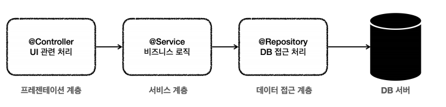
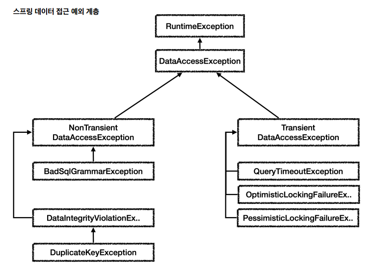

# 수정
# 스프링 DB 1편 - 데이터 접근 핵심 원리

## 1. JDBC 이해

### JDBC 이해

#### JDBC 등장 이유
애플리케이션을 개발할 때 중요한 데이터는 대부분 데이터베이스에 보관한다.

클라이언트가 애플리케이션 서버를 통해 데이터를 저장하거나 조회하면, 애플리케이션 서버는 다음 과정을 통해서 데이터베이스를 사용한다.


DB를 변경하고자 할 때, 문제는 각각의 데이터베이스마다 커넥션을 연결하는 방법, SQL을 전달하는 방법, 그리고 결과를 응답 받는 방법이 모두 다르다는 점이다.

여기에는 2가지 큰 문제가 있다.
1. 데이터베이스를 다른 종류의 데이터베이스로 변경하면 애플리케이션 서버에 개발된 데이터베이스 사용 코드도 함께 변경해야 한다.
2. 개발자가 각각의 데이터베이스마다 커넥션 연결, SQL 전달, 그리고 그 결과를 응답 받는 방법을 새로 학습해야 한다.

이런 문제를 해결하기 위해 JDBC라는 자바 표준이 등장한다.

### JDBC 표준 인터페이스
JDBC(Java Database Connectivity)는 자바에서 데이터베이스에 접속할 수 있도록 하는 자바 API다.
JDBC는 데이터베이스에서 자료를 쿼리하거나 업데이트하는 방법을 제공한다. - 위키백과


JDBC의 등장으로 다음 2가지 문제가 해결되었다.
1. 애플리케이션 로직은 이제 JDBC 표준 인터페이스에만 의존한다.
2. 개발자는 JDBC 표준 인터페이스 사용법만 학습하면 된다.

#### 표준화의 한계
JDBC의 등장으로 많은 것이 편리해졌지만, 각각의 데이터베이스마다 SQL, 데이터타입 등의 일부 사용법 다르다.
ANSI SQL이라는 표준이 있기는 하지만 일반적인 부분만 공통화했기 때문에 한계가 있다. 대표적으로 실무에서 기본으로 사용하는 페이징 SQL은 각각의 데이터베이스마다 사용법이 다르다.

### JDBC와 최신 데이터 접근 기술
JDBC는 1997년에 출시될 정도로 오래된 기술이고, 사용하는 방법도 복잡하다.
그래서 최근에는 JDBC를 직접 사용하기 보다는 JDBC를 편리하게 사용하는 다양한 기술이 존재한다.
대표적으로 SQL Mapper와 ORM 기술로 나눌 수 있다.


#### SQL Mapper vs ORM 기술
SQL Mapper는 SQL만 직접 작성하면 나머지 번거로운 일은 SQL Mapper가 대신 해결해준다.
SQL Mapper는 SQL만 작성할 줄 알면 금방 배워서 사용할 수 있다.

ORM기술은 SQL 자체를 작성하지 않아도 되어서 개발 생산성이 매우 높아진다. 
편리한 반면에 쉬운 기술은 아니므로 실무에서 사용하려면 깊이있게 학습해야 한다.

이런 기술들도 내부에서는 모두 JDBC를 사용한다. 따라서 JDBC를 직접 사용하지는 않더라도, JDBC가 어떻게 동작하는지 기본 원리를 알아두어야 한다.

### 데이터베이스 연결(H2 데이터베이스 사용)
애플리케이션과 데이터베이스를 연결해보자

#### ConnectionConst
```java
public abstract class ConnectionConst {
    public static final String URL = "jdbc:h2:tcp://localhost/~/test";
    public static final String USERNAME = "sa";
    public static final String PASSWORD = "";
}
```

#### DBConnectionUtil
```java
@Slf4jpublic class DBConnectionUtil {
    public static Connection getConnection() {
        try {
            Connection connection = DriverManager.getConnection(URL, USERNAME,
                    PASSWORD);
            log.info("get connection={}, class={}", connection,
                    connection.getClass());
            return connection;
        } catch (SQLException e) {
            throw new IllegalStateException(e);
        }
    }
}
```

데이터베이스에 연결하려면 JDBC가 제공하는 `DriverManager.getConnection(..)`를 사용하면 된다.
이렇게 하면 라이브러리에 있는 데이터베이스 드라이버를 찾아서 해당 드라이버가 제공하는 커넥션을 반환해준다.

#### JDBC 커넥션 인터페이스와 구현


#### DriverManager 커넥션 요청 흐름


1. 애플리케이션 로직에서 커넥션이 필요하면 `DriverManager.getConnection()`을 호출한다.
2. `DriverManager` 는 라이브러리에 등록된 드라이버 목록을 자동으로 인식한다. 이 드라이버들에게 순서대로 다음 정보를 넘겨서 커넥션을 획득할 수 있는지 확인한다.
3. 이렇게 찾은 커넥션 구현체가 클라이언트에 반환된다.

### JDBC 개발 - 등록

#### 회원 등록 예시 코드
```java
/**
 * JDBC - DriverManager 사용
 */
@Slf4jpublic class MemberRepositoryV0 {
    public Member save(Member member) throws SQLException {
        String sql = "insert into member(member_id, money) values(?, ?)";
        Connection con = null;
        PreparedStatement pstmt = null;
        try {
            con = getConnection();
            pstmt = con.prepareStatement(sql);
            pstmt.setString(1, member.getMemberId());
            pstmt.setInt(2, member.getMoney());
            pstmt.executeUpdate();
            return member;
        } catch (SQLException e) {
            log.error("db error", e);
            throw e;
        } finally {
            close(con, pstmt, null);
        }
    }

    private void close(Connection con, Statement stmt, ResultSet rs) {
        if (rs != null) {
            try {
                rs.close();
            } catch (SQLException e) {
                log.info("error", e);
            }
        }
        if (stmt != null) {
            try {
                stmt.close();
            } catch (SQLException e) {
                log.info("error", e);
            }
        }
        if (con != null) {
            try {
                con.close();
            } catch (SQLException e) {
                log.info("error", e);
            }
        }
    }

    private Connection getConnection() {
        return DBConnectionUtil.getConnection();
    }
}
```

#### 리소스 정리
쿼리를 실행하고 나면 리소스를 정리해야 한다. 여기서는 `Connection`, `PreparedStatement`를 사용했다.
리소스를 정리할 때는 항상 역순으로 해야한다.

리소스 정리는 꼭! 해주어야 한다. 따라서 예외가 발생하든, 하지 않든 항상 수행되어야 하므로 `finally`구문에 주의해서 작성해야 한다.
이 부분을 놓치게 되면 리소스 누수가 발생하고 결과적으로 커넥션 부족으로 장애가 발생할 수 있다.

### JDBC 개발 - 조회

#### 회원 조회 사용 예시
```java
public Member findById(String memberId) throws SQLException {
    String sql = "select * from member where member_id = ?";
    Connection con = null;
    PreparedStatement pstmt = null;
    ResultSet rs = null;
    try {
        con = getConnection();
        pstmt = con.prepareStatement(sql);
        pstmt.setString(1, memberId);
        rs = pstmt.executeQuery();
        if (rs.next()) {
            Member member = new Member();
            member.setMemberId(rs.getString("member_id"));
            member.setMoney(rs.getInt("money"));
            return member;
        } else {
            throw new NoSuchElementException("member not found memberId=" +
                    memberId);
        }
    } catch (SQLException e) {
        log.error("db error", e);
        throw e;
    } finally {
        close(con, pstmt, rs);
    }
}
```

#### ResultSet
- 보통 select 쿼리의 결과가 순서대로 들어간다.
- `ResultSet` 내부에 있는 커서(`cursor`)를 이동해서 다음 데이터를 조회할 수 있다.
- `rs.next()` : 이것을 호출하면 커서가 다음으로 이동한다. 참고로 최초의 커서는 데이터를 가리키고 있지 않기 때문에 rs.next() 를 최초 한번은 호출해야 데이터를 조회할 수 있다

#### ResultSet 결과 예시


## 2. 커넥션풀과 데이터소스 이해

### 커넥션 풀 이해

#### 데이터베이스 커넥션을 매번 획득


데이터베이스 커넥션을 획득할 때는 다음과 같은 복잡한 과정을 거친다.
1. 애플리케이션 로직은 DB 드라이버를 통해 커넥션을 조회한다.
2. DB 드라이버는 DB와 TCP/IP 커넥션을 연결한다. 물론 이 과정에서 3 way handshake 같은 TCP/IP 연결을 위한 네트워크 동작이 발생한다.
3. DB 드라이버는 TCP/IP 커넥션이 연결되면 ID, PW와 기타 부가정보를 DB에 전달한다.
4. DB는 ID, PW를 통해 내부 인증을 완료하고, 내부에 DB 세션을 생성한다.
5. DB는 커넥션 생성이 완료되었다는 응답을 보낸다.
6. DB 드라이버는 커넥션 객체를 생성해서 클라이언트에 반환한다.

이렇게 커넥션을 새로 만드는 것은 과정도 복잡하고 시간도 많이 소모되는 일이다.
DB는 물론이고 애플리케이션 서버에서도 리소스를 매번 사용해야 한다.

이런 문제를 한번에 해결하는 아이디어가 바로 커넥션을 미리 생성해두고 사용하는 커넥션 풀이라는 방법이다.
커넥션 풀은 이름 그대로 커넥션을 관리하는 풀이다.

애플리케이션을 시작하는 시점에 커넥션 풀은 필요한 만큼 커넥션을 미리 확보해서 풀에 보관한다.
서비스의 특징과 서버 스펙에 따라 다르지만 기본값은 보통 10개이다.


- 커넥션 풀은 서버당 최대 커넥션 수를 제한할 수 있다. 따라서 DB에 무한정 연결이 생성되는 것을 막아주어서 DB를 보호하는 효과도 있다.
- 이런 커넥션 풀은 얻는 이점이 매우 크기 때문에 실무에서는 항상 기본으로 사용한다.
- 커넥션 풀은 개념적으로 단순해서 직접 구현할 수도 있지만, 사용도 편리하고 성능도 뛰어난 오픈소스 커넥션 풀이 많기 때문에 오픈소스를 사용하는 것이 좋다.
- 성능과 사용의 편리함 측면에서 최근에는 hikariCP 를 주로 사용한다. 

### DataSource 이해

#### 커넥션을 획득하는 다양한 방법


#### DriverManager를 통해 커넥션 획득하다가 커넥션 풀로 변경시 문제
애플리케이션 로직에서 DriverManager 를 사용해서 커넥션을 획득하다가 HikariCP 같은 커넥션 풀을 사용하도록 변경하면 커넥션을 획득하는 애플리케이션 코드도 함께 변경해야 한다. 
의존관계가 DriverManager 에서 HikariCP 로 변경되기 때문이다. 
물론 둘의 사용법도 조금씩 다를 것이다.

#### 커넥션을 획득하는 방법을 추상화


* 자바에서는 이런 문제를 해결하기 위해 `javax.sql.DataSource` 라는 인터페이스를 제공한다.
* `DataSource`는 커넥션을 획득하는 방법을 추상화 하는 인터페이스이다.
* 이 인터페이스의 핵심 기능은 커넥션 조회 하나이다. (다른 일부 기능도 있지만 크게 중요하지 않다.)

#### DataSource 인터페이스
```java
public interface DataSource {
    Connection getConnection() throws SQLException;
}
```

대부분의 커넥션 풀은 DataSource 인터페이스를 이미 구현해두었다. 
따라서 개발자는 DBCP2 커넥션 풀, HikariCP 커넥션 풀 의 코드를 직접 의존하는 것이 아니라 DataSource 인터페이스에만 의존하도록 애플리케이션 로직을 작성하면 된다.

`DriverManager`는 `DataSource` 인터페이스를 사용하지 않는다. 
따라서 `DriverManager` 는 직접 사용해야 한다. 
따라서 `DriverManager` 를 사용하다가 `DataSource`기반의 커넥션 풀을 사용하도록 변경하면 관련 코드를 다 고쳐야 한다. 
이런 문제를 해결하기 위해 스프링은 `DriverManager` 도 `DataSource` 를 통해서 사용할 수 있도록 `DriverManagerDataSource` 라는 `DataSource` 를 구현한 클래스를 제공한다.

### DataSource 예제1 - DriverManager

#### 사용 예시
```java
@Test
 void dataSourceDriverManager() throws SQLException {
    //DriverManagerDataSource - 항상 새로운 커넥션 획득
    DriverManagerDataSource dataSource = new DriverManagerDataSource(URL,
            USERNAME, PASSWORD);
    useDataSource(dataSource);
}
private void useDataSource(DataSource dataSource) throws SQLException {
    Connection con1 = dataSource.getConnection();
    Connection con2 = dataSource.getConnection();
    log.info("connection={}, class={}", con1, con1.getClass());
    log.info("connection={}, class={}", con2, con2.getClass());
}
```

`DriverManager` 는 커넥션을 획득할 때 마다 `URL` , `USERNAME` , `PASSWORD` 같은 파라미터를 계속 전달해야 한다. 
반면에 `DataSource` 를 사용하는 방식은 처음 객체를 생성할 때만 필요한 파리미터를 넘겨두고, 커넥션을 획득할 때는 단순히 `dataSource.getConnection()` 만 호출하면 된다.

### DataSource 예제2 - 커넥션 풀

#### 데이터소스 커넥션 풀 사용 예시
```java
@Test
void dataSourceConnectionPool() throws SQLException, InterruptedException {
    //커넥션 풀링: HikariProxyConnection(Proxy) -> JdbcConnection(Target)
    HikariDataSource dataSource = new HikariDataSource();
    dataSource.setJdbcUrl(URL);
    dataSource.setUsername(USERNAME);
    dataSource.setPassword(PASSWORD);
    dataSource.setMaximumPoolSize(10);
    dataSource.setPoolName("MyPool");
    useDataSource(dataSource);
    Thread.sleep(1000); //커넥션 풀에서 커넥션 생성 시간 대기 로그 확인 용
}
```

## 3. 트랜잭션 이해

### 트랜잭션 - 개념 이해
데이터를 저장할 때 단순히 파일에 저장해도 되는데, 데이터베이스에 저장하는 이유는 무엇일까?

여러가지 이유가 있지만, 가장 대표적인 이유는 바로 데이터베이스는 트랜잭션이라는 개념을 지원하기 때문이다.

트랜잭션을 이름 그대로 번역하면 거래라는 뜻이다. 이것을 쉽게 풀어서 이야기하면, 데이터베이스에서 트랜잭션은 하
나의 거래를 안전하게 처리하도록 보장해주는 것을 뜻한다.

모든 작업이 성공해서 데이터베이스에 정상 반영하는 것을 커밋( Commit )이라 하고, 작업 중 하나라도 실패해서 거래
이전으로 되돌리는 것을 롤백( Rollback )이라 한다.

#### 트랜잭션 ACID
* **원자성**: 트랜잭션 내에서 실행한 작업들은 마치 하나의 작업인 것처럼 모두 성공 하거나 모두 실패해야 한다.
* **일관성**: 모든 트랜잭션은 일관성 있는 데이터베이스 상태를 유지해야 한다. 예를 들어 데이터베이스에서 정한 무결성 제약 조건을 항상 만족해야 한다.
* **격리성**: 동시에 실행되는 트랜잭션들이 서로에게 영향을 미치지 않도록 격리한다. 예를 들어 동시에 같은 데이터를 수정하지 못하도록 해야 한다. 격리성은 동시성과 관련된 성능 이슈로 인해 트랜잭션 격리 수준(Isolation level)을 선택할 수 있다.
* **지속성**: 트랜잭션을 성공적으로 끝내면 그 결과가 항상 기록되어야 한다. 중간에 시스템에 문제가 발생해도 데이터베이스 로그 등을 사용해서 성공한 트랜잭션 내용을 복구해야 한다.

#### 트랜잭션 격리 수준 - Isolation level
* READ UNCOMMITED(커밋되지 않은 읽기)
* READ COMMITTED(커밋된 읽기) - 일반적으로 많이 사용
* REPEATABLE READ(반복 가능한 읽기)
* SERIALIZABLE(직렬화 가능)

### 데이터베이스 연결 구조와 DB 세션

#### 데이터베이스 연결 구조


* 개발자가 클라이언트를 통해 SQL을 전달하면 현재 커넥션에 연결된 세션이 SQL을 실행한다.
* 세션은 트랜잭션을 시작하고, 커밋 또는 롤백을 통해 트랜잭션을 종료한다. 그리고 이후에 새로운 트랜잭션을 다시 시작할 수 있다.
* 사용자가 커넥션을 닫거나, 또는 DBA(DB 관리자)가 세션을 강제로 종료하면 세션은 종료된다.

### DB 락 - 개념 이해
세션1이 트랜잭션을 시작하고 데이터를 수정하는 동안 아직 커밋을 수행하지 않았는데, 세션2에서 동시에 같은 데이터를 수정하게 되면 여러가지 문제가 발생한다. 
바로 트랜잭션의 원자성이 깨지는 것이다.

이런 문제를 방지하려면, 세션이 트랜잭션을 시작하고 데이터를 수정하는 동안에는 커밋이나 롤백 전까지 다른 세션에서 해당 데이터를 수정할 수 없게 막아야 한다.

### DB 락 - 조회

#### 일반적인 조회는 락을 사용하지 않는다.
데이터베이스마다 다르지만, 보통 데이터를 조회할 때는 락을 획득하지 않고 바로 데이터를 조회할 수 있다

#### 조회와 락
데이터를 조회할 때도 락을 획득하고 싶을 때가 있다. 이럴 때는 `select for update` 구문을 사용하면 된다.

### 트랜잭션 - 적용


- 트랜잭션은 비즈니스 로직이 있는 서비스 계층에서 시작해야 한다. 비즈니스 로직이 잘못되면 해당 비즈니스 로직으로 인해 문제가 되는 부분을 함께 롤백해야 하기 때문이다.
- 애플리케이션에서 DB 트랜잭션을 사용하려면 트랜잭션을 사용하는 동안 같은 커넥션을 유지해야한다. 그래야 같
  은 세션을 사용할 수 있다.

## 4. 스프링과 문제 해결 - 트랜잭션

### 문제점들

#### 애플리케이션 구조
여러가지 애플리케이션 구조가 있지만, 가장 단순함녀서 많이 사용하는 방법은 역할에 따라 3가지 계층으로 나눈 것이다.


여기서 가장 중요한 곳은 어디일까? 바로 비즈니스 로직이 들어있는 서비스 계층이다. 
시간이 흘러서 웹과 관련된 부분이 변하고, 데이터 저장 기술을 다른 기술로 변경해도, 비즈니스 로직은 최대한 변경없이 유지되어야 한다.

이렇게 하려면 서비스 계층은 특정 기술에 종속적이지 않게 개발해야 한다.
그래야 비즈니스 로직을 유지보수 하기도 쉽고, 테스트 하기도 쉽다.

#### 문제 정리
이전에 개발한 애플리케이션의 문제점은 크게 3가지이다.
- 트랜잭션 문제
- 예외 누수 문제
- JDBC 반복 문제

스프링은 서비스 계층을 순수하게 유지하면서, 지금까지 이야기한 문제들을 해결할 수 있는 다양한 방법과 기술들을 제공한다.

### 트랜잭션 추상화

#### 구현 기술에 따른 트랜잭션 사용법
- 트랜잭션은 원자적 단위의 비즈니스 로직을 처리하기 위해 사용한다.
- 구현 기술마다 트랜잭션을 사용하는 방법이 다르다.
  - JDBC: con.setAutoCommit(false)
  - JPA: transaction.begin()

트랜잭션을 사용하는 코드는 데이터 접근 기술마다 다르다. 
JDBC 기술을 사용하다가 JPA 기술로 변경하게 되면 서비스 계층의 코드도 JPA 기술을 사용하도록 함께 수정해야 한다.

#### 트랜잭션 추상화
트랜잭션 기능을 추상화하면 이 문제를 해결할 수 있다.

#### 트랜잭션 추상화 인터페이스
```java
public interface TxManager {
    begin();

    commit();

    rollback();
}
```
다음과 같이 `TxManager` 인터페이스를 기반으로 각각의 기술에 맞는 구현체를 만들면 된다.
* `JdbcTxManager` : JDBC 트랜잭션 기능을 제공하는 구현체
* `JpaTxManager` : JPA 트랜잭션 기능을 제공하는 구현체

#### 트랜잭션 추상화와 의존관계


#### 스프링의 트랜잭션 추상화


### 트랜잰션 동기화
스프링이 제공하는 트랜잭션 매니저는 크게 2가지 역할을 한다.
- 트랜잭션 추상화
- 리소스 동기화

#### 리소스 동기화
- 트랜잭션을 유지하려면 트랜잭션의 시작부터 끝까지 같은 데이터베이스 커넥션을 유지해아한다.
- 스프링은 트랜잭션 동기화 매니저를 제공한다. 이것은 쓰레드 로컬(`ThreadLocal`)을 사용해서 커넥션을 동기화해준다. 트랜잭션 매니저는 내부에서 이 트랜잭션 동기화 매니저를 사용한다.
- 트랜잭션 동기화 매니저는 쓰레드 로컬을 사용하기 때문에 멀티쓰레드 상황에 안전하게 커넥션을 동기화 할 수 있다.

#### 동작 방식
1. 트랜잭션을 시작하려면 커넥션이 필요하다. 트랜잭션 매니저는 데이터소스를 통해 커넥션을 만들고 트랜잭션을
   시작한다.
2. 트랜잭션 매니저는 트랜잭션이 시작된 커넥션을 트랜잭션 동기화 매니저에 보관한다.
3. 리포지토리는 트랜잭션 동기화 매니저에 보관된 커넥션을 꺼내서 사용한다. 따라서 파라미터로 커넥션을 전달하지 않아도 된다.
4. 트랜잭션이 종료되면 트랜잭션 매니저는 트랜잭션 동기화 매니저에 보관된 커넥션을 통해 트랜잭션을 종료하고,
   커넥션도 닫는다.

### 트랜잭션 템플릿
트랜잭션을 사용하는 로직을 살펴보면 같은 패턴이 반복되는 것을 확인할 수 있다.

#### 트랜잭션 사용 코드
```java
//트랜잭션 시작
TransactionStatus status = transactionManager.getTransaction(new
DefaultTransactionDefinition());

try {
 //비즈니스 로직
    bizLogic(fromId, toId, money);
    transactionManager.commit(status); //성공시 커밋
} catch (Exception e){
    transactionManager.rollback(status); //실패시 롤백
    throw newIllegalStateException(e);
}
```

#### TransactionTemplate
```java
public class TransactionTemplate {
    private PlatformTransactionManager transactionManager;

    public <T> T execute(TransactionCallback<T> action) {..}

    void executeWithoutResult(Consumer<TransactionStatus> action) {..}
}
```
트랜잭션 템플릿의 기본 동작은 다음과 같다.
* 비즈니스 로직이 정상 수행되면 커밋한다.
* 언체크 예외가 발생하면 롤백한다. 그 외의 경우 커밋한다. (체크 예외의 경우에는 커밋하는데, 이 부분은 뒤에서 설명한다.)

### 트랜잭션 문제 해결 - 트랜잭션 AOP 이해
서비스 계층에 순수한 비즈니스 로직만 남기려면 스프링 AOP를 통해 프록시를 도입하면 문제를 깔끔하게 해결할 수 있다.

#### 프록시를 통한 문제 해결


#### 스프링이 제공하는 트랜잭션 AOP
개발자는 트랜잭션 처리가 필요한 곳에 `@Transactional` 애노테이션만 붙여주면 된다. 스프링의 트랜잭션
AOP는 이 애노테이션을 인식해서 트랜잭션 프록시를 적용해준다.

### 트랜잭션 문제 해결 - 트랜잭션 AOP 적용
#### 적용 예시
```java
@Transactional
public void accountTransfer(String fromId, String toId, int money) throws
SQLException {
    bizLogic(fromId, toId, money);
}
```
* 순수한 비즈니스 로직만 남기고, 트랜잭션 관련 코드는 모두 제거했다.
* 스프링이 제공하는 트랜잭션 AOP를 적용하기 위해 @Transactional 애노테이션을 추가했다.
* @Transactional 애노테이션은 메서드에 붙여도 되고, 클래스에 붙여도 된다. 클래스에 붙이면 외부에서 호출 가능한 public 메서드가 AOP 적용 대상이 된다.

### 트랜잭션 문제 해결 - 트랜잭션 AOP 정리

#### 트랜잭션 AOP 적용 전체 흐름


### 스프링 부트의 자동 리소스 등록
스프링 부트가 등장하기 이전에는 데이터소스와 트랜잭션 매니저를 개발자가 직접 스프링 빈으로 등록해서 사용했다.
그런데 스프링 부트로 개발을 시작한 개발자라면 데이터소스나 트랜잭션 매니저를 직접 등록한 적이 없을 것이다.

#### 데이터소스와 트랜잭션 매니저를 스프링 빈으로 직접 등록
```java
@Bean
DataSource dataSource() {
    return new DriverManagerDataSource(URL, USERNAME, PASSWORD);
}
@Bean
PlatformTransactionManager transactionManager() {
    return new DataSourceTransactionManager(dataSource());
}
```
기존에는 이렇게 데이터소스와 트랜잭션 매니저를 직접 스프링 빈으로 등록해야 했다.
그런데 스프링 부트가 나오면서 많은 부분이 자동화되었다.

#### 데이터소스 - 자동 등록
* 스프링 부트는 데이터소스( DataSource )를 스프링 빈에 자동으로 등록한다.
* 자동으로 등록되는 스프링 빈 이름: `dataSource`
* 참고로 개발자가 직접 데이터소스를 빈으로 등록하면 스프링 부트는 데이터소스를 자동으로 등록하지 않는다.

이때 스프링 부트는 다음과 같이 `application.properties` 에 있는 속성을 사용해서 DataSource 를 생성한다.
그리고 스프링 빈에 등록한다.
```
in application.properties
spring.datasource.url=jdbc:h2:tcp://localhost/~/test
spring.datasource.username=sa
spring.datasource.password=
```

#### 트랜잭션 매니저 - 자동 등록
* 스프링 부트는 적절한 트랜잭션 매니저(`PlatformTransactionManager`)를 자동으로 스프링 빈에 등록한다.
* 자동으로 등록되는 스프링 빈 이름: `transactionManager`
* 참고로 개발자가 직접 트랜잭션 매니저를 빈으로 등록하면 스프링 부트는 트랜잭션 매니저를 자동으로 등록하지 않는다.

어떤 트랜잭션 매니저를 선택할지는 현재 등록된 라이브러리를 보고 판단하는데,
둘다 사용하는 경우 `JpaTransactionManager` 를 등록한다. 
참고로 `JpaTransactionManager는` `DataSourceTransactionManager` 가 제공하는 기능도 대부분 지원한다.

## 5. 자바 예외 이해

### 예외 계층
스프링이 제공하는 예외 추상화를 이해하기 위해서는 먼저 자바 기본 예외에 대한 이해가 필요하다.

#### 예외 계층 그림


* `Object` : 예외도 객체이다. 모든 객체의 최상위 부모는 Object 이므로 예외의 최상위 부모도 Object 이다.
* `Throwable` : 최상위 예외이다. 하위에 Exception 과 Error 가 있다.
* `Error` : 메모리 부족이나 심각한 시스템 오류와 같이 애플리케이션에서 복구 불가능한 시스템 예외이다.  애플리케이션 개발자는 이 예외를 잡으려고 해서는 안된다
* `Exception` : 체크 예외, 애플리케이션 로직에서 사용할 수 있는 실질적인 최상위 예외이다.
* `RuntimeException` : 언체크 예외, 런타임 예외, 컴파일러가 체크 하지 않는 언체크 예외이다

### 예외 기본 규칙
예외는 폭탄 돌리기와 같다. 잡아서 처리하거나, 처리할 수 없으면 밖으로 던져야한다.


#### 예외를 처리하지 못하고 계속 던지면 어떻게 될까?
* 자바 main() 쓰레드의 경우 예외 로그를 출력하면서 시스템이 종료된다.
* 웹 애플리케이션의 경우 여러 사용자의 요청을 처리하기 때문에 하나의 예외 때문에 시스템이 종료되면 안된다. WAS가 해당 예외를 받아서 처리하는데, 주로 사용자에게 개발자가 지정한 오류 페이지를 보여준다.

### 체크 예외 기본 이해
* `Exception` 과 그 하위 예외는 모두 컴파일러가 체크하는 체크 예외이다. 단 `RuntimeException` 은 예외로 한다.
* 체크 예외는 잡아서 처리하거나, 또는 밖으로 던지도록 선언해야한다. 그렇지 않으면 컴파일 오류가 발생한다.

#### 체크 예외의 장단점
* 장점: 개발자가 실수로 예외를 누락하지 않도록 컴파일러를 통해 문제를 잡아주는 훌륭한 안전 장치이다.
* 단점: 하지만 실제로는 개발자가 모든 체크 예외를 반드시 잡거나 던지도록 처리해야 하기 때문에, 너무 번거로운
일이 된다. 크게 신경쓰고 싶지 않은 예외까지 모두 챙겨야 한다. 추가로 의존관계에 따른 단점도 있는데 이 부분
은 뒤에서 설명하겠다.

### 언체크 예외 기본 이해
* `RuntimeException` 과 그 하위 예외는 언체크 예외로 분류된다.
* 언체크 예외는 말 그대로 컴파일러가 예외를 체크하지 않는다는 뜻이다.
* 언체크 예외는 체크 예외와 기본적으로 동일하다. 차이가 있다면 예외를 던지는 throws 를 선언하지 않고, 생략할 수 있다. 이 경우 자동으로 예외를 던진다.

#### 체크 예외 vs 언체크 예외
* 체크 예외: 예외를 잡아서 처리하지 않으면 항상 throws 에 던지는 예외를 선언해야 한다.
* 언체크 예외: 예외를 잡아서 처리하지 않아도 throws 를 생략할 수 있다.

#### 언체크 예외의 장단점
* 장점: 신경쓰고 싶지 않은 언체크 예외를 무시할 수 있다. 체크 예외의 경우 처리할 수 없는 예외를 밖으로 던지려
면 항상 `throws 예외` 를 선언해야 하지만, 언체크 예외는 이 부분을 생략할 수 있다. 이후에 설명하겠지만, 신경
쓰고 싶지 않은 예외의 의존관계를 참조하지 않아도 되는 장점이 있다.
* 단점: 언체크 예외는 개발자가 실수로 예외를 누락할 수 있다. 반면에 체크 예외는 컴파일러를 통해 예외 누락을
잡아준다.

### 체크 예외 활용
그렇다면 언제 체크 예외를 사용하고 언제 언체크 예외를 사용하면 좋을까?

#### 기본 원친은 다음 2가지를 기억하자
- 기본적으로 언체크 예외를 사용하자
- 체크 예외는 비즈니스 로직상 의도적으로 던지는 예외에만 사용하자.
  - 예시) 계좌 이체 실패 예외, 결제시 포인트 부족 예외, 로그인 ID, PW 불일치 예외
- 위 경우에도 100% 체크 예외로 만들어야 하는 것은 아니지만 매우 심각한 문제는 개발자가 실수로 예외를 놓치면 안된다고 판단할 수 있다. 이 경우 컴파일러를 통해 놓친 예외를 인지할 수 있다.

#### 체크 예외의 문제점
체크 예외는 컴파일러가 예외 누락을 체크해주기 때문에 개발자가 실수로 예외를 놓치는 것을 막아준다.
체크 예외가 런타임 예외보다 더 안전하고 좋아보이는데, 왜 체크 예외를 기본으로 사용하는 것이 문제가 될까?


1. 복구 불가능한 예외
2. 의존 관계에 대한 문제

#### 복구 불가능한 예외
대부분의 예외는 복구가 불가능하다. 일부 복구가 가능한 예외도 있지만 아주 적다.
`SQLException` 을 예를 들면 데이터베이스에 무언가 문제가 있어서 발생하는 예외이다. 
SQL 문법에 문제가 있을 수도 있고, 데이터베이스 자체에 뭔가 문제가 발생했을 수도 있다. 
데이터베이스 서버가 중간에 다운 되었을 수도 있다.
이런 문제들은 대부분 복구가 불가능하다. 
특히나 대부분의 서비스나 컨트롤러는 이런 문제를 해결할 수는 없다. 
따라서 이런 문제들은 일관성 있게 공통으로 처리해야 한다. 
오류 로그를 남기고 개발자가 해당 오류를 빠르게 인지하는 것이 필요하다. 
서블릿 필터, 스프링 인터셉터, 스프링의 ControllerAdvice 를 사용하면 이런 부분을 깔끔하게 공통으로 해결할 수 있다.

#### 의존 관계에 대한 문제
체크 예외의 또 다른 심각한 문제는 예외에 대한 의존 관계 문제이다.
앞서 대부분의 예외는 복구 불가능한 예외라고 했다.
그런데 체크 예외이기 때문에 컨트롤러나 서비스 입장에서는 본인이 처리할 수 없어도 어쩔 수 없이 throws 를 통해 던지는 예외를 선언해야 한다.
예외를 던지는 부분을 코드에 선언하는 것은 특정 기술에 의존하기 때문에 문제가 된다.
향후 리포지토리 등을 변경하면 다른 기술에 의존하도록 고쳐야 한다.


이 최상위 예외인 Exception 을 던져도 문제를 해결할 수 있지만 이렇게 하면 모든 예외를 다 던지기 때문에 이는 좋지 않은 방법이다.

### 언체크 예외 활용


#### 런타임 예외 - 대부분 복구 불가능한 예외
시스템에서 발생한 예외는 대부분 복구 불가능 예외이다.
런타임 예외를 사용하면 서비스나 컨트롤러가 이런 복구 불가 능한 예외를 신경쓰지 않아도 된다.
물론 이렇게 복구 불가능한 예외는 일관성 있게 공통으로 처리해야 한다.

#### 런타임 예외 - 의존 관계에 대한 문제
런타임 예외는 해당 객체가 처리할 수 없는 예외는 무시하면 된다. 
따라서 체크 예외 처럼 예외를 강제로 의존하지 않아도 된다.

#### 정리
처음 자바를 설계할 당시에는 쳬크 예외가 더 나은 선택이라 생각했다. 그래서 자바는 기본으로 제공하는 기능들에는 체크 예외가 많다.
그렇데 시간이 흐르면서 복구할 수 없는 예외가 너무 많아졌다. 특히 라이브러리를 점점 더 많이 사용하면서 처리해야 하는 예외도 늘어났다.
체크 예외의 문제점 때문에 최근 라이브러리들은 대부분 런타임 예외를 기본으로 제공한다. 사실 위에서 예시로 설
명한 JPA 기술도 런타임 예외를 사용한다. 스프링도 대부분 런타임 예외를 제공한다.
런타임 예외도 필요하면 잡을 수 있기 때문에 필요한 경우에는 잡아서 처리하고, 그렇지 않으면 자연스럽게 던지도록 둔다.
그리고 예외를 공통으로 처리하는 부분을 앞에 만들어서 처리하면 된다.

#### 런타임 예외는 문서화
* 런타임 예외는 문서화를 잘해야 한다.
* 또는 코드에 `throws 런타임예외`을 남겨서 중요한 예외를 인지할 수 있게 해준다.

### 예외 포함과 스택 트레이스
예외를 전환할 때는 꼭! 기존 예외를 포함해야 한다. 그렇지 않으면 스택 트레이스를 확인할 때 심각한 문제가 발생한다.

예외를 포함하지 않으면 기존에 발생한 예외와 스택 트레이스를 확인할 수 없다.

## 6. 스프링과 문제 해결 - 예외 처리, 반복

### 체크 예외와 인터페이스
서비스 계층은 가급적 특정 구현 기술에 의존하지 않고, 순수하게 유지하는 것이 좋다. 
이렇게 하려면 예외에 대한 의존도 함께 해결해야한다.

### 인터페이스 도입

- 인터페이스를 도입하면 `MemberService`는 `MemberRepository` 인터페이스에만 의존하면 된다.
- 구현 기술을 변경하고 싶으면 DI를 사용해서 `MeberService` 코드의 변경 없이 구현 기술을 변경할 수 있따.

#### 특정 기술에 종속되는 인터페이스
구현 기술을 쉽게 변경하기 위해서 인터페이스를 도입하더라도 `SQLException`과 같은 특정 구현 기술에 종속적인 체크 예외를 사용하게 되면 인터페이스에도 해당 예외를 포함해야 한다.
인터페이스를 만드는 목적은 구현체를 쉽게 변경하기 위함인데, 이미 인터페이스가 특정 구현 기술에 오염이 되어 버렸다.
향후 JDBC가 아닌 다른 기술로 변경한다면 인터페이스 자체를 변경해야 한다.

#### 런타임 예외와 인터페이스
런타임 예외는 이런 부분에서 자유롭다. 인터페이스에 런타임 예외를 따로 선언하지 않아도 된다.
따라서 인터페이스가 특정 기술에 종속적일 필요가 없다.

### 데이터 접근 예외 직접 만들기


- SQL ErrorCode로 데이터베이스에 어떤 오류가 있는지 확인할 수 있었다.
- 예외 변환을 통해 `SQLException`을 특정 기술에 의존하지 않는 직접 만든 예외로 변환할 수 있다.
- 리포지토리 계층이 예외를 변환해준 덕분에 서비스 계층은 특정 기술에 의존하지 않는 순수성을 유지할 수 있다.
- 하지만 SQL ErrorCode는 각각의 데이터베이스마다 다르다는 문제점이 있다.

### 스프링 예외 추상화 이해
스프링은 앞서 설명한 문제들을 해결하기 위해 데이터 접근과 관련된 예외를 추상화해서 제공한다.


* 스프링은 데이터 접근 계층에 대한 수십 가지 예외를 정리해서 일관된 예외 계층을 제공한다.
* 각각의 예외는 특정 기술에 종속적이지 않게 설계되어 있다. 따라서 서비스 계층에서도 스프링이 제공하는 예외를
사용하면 된다. 예를 들어서 JDBC 기술을 사용하든, JPA 기술을 사용하든 스프링이 제공하는 예외를 사용하면
된다.
* JDBC나 JPA를 사용할 때 발생하는 예외를 스프링이 제공하는 예외로 변환해주는 역할도 스프링이 제공한다.

#### SQLExceptionTranslator
* 스프링은 데이터베이스에서 발생하는 오류 코드를 스프링이 정의한 예외로 자동으로 변환해주는 변환기 `SQLExceptionTranslator`를 제공한다.
```java
SQLExceptionTranslator exTranslator = new
        SQLErrorCodeSQLExceptionTranslator(dataSource);
DataAccessException resultEx = exTranslator.translate("select", sql, e);
```

### JDBC 반복 문제 해결 - JdbcTemplate

#### JDBC 반복 문제
* 커넥션 조회, 커넥션 동기화
* PreparedStatement 생성 및 파라미터 바인딩
* 쿼리 실행
* 결과 바인딩
* 예외 발생시 스프링 예외 변환기 실행
* 리소스 종료

스프링은 이 문제를 해결하기 위해 `JdbcTemplate`이라는 템플릿을 제공한다.

`JdbcTemplate` 은 JDBC로 개발할 때 발생하는 반복을 대부분 해결해준다. 
그 뿐만 아니라 지금까지 학습했던, 트랜잭션을 위한 커넥션 동기화는 물론이고, 예외 발생시 스프링 예외 변환기도 자동으로 실행해준다.


