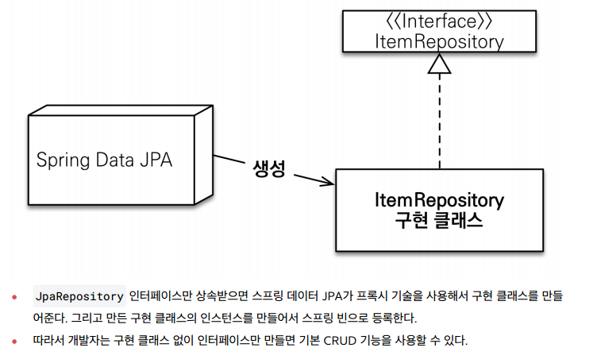

# 수정
# 스프링 DB 2편 - 데이터 접근 활용 기술

## 1. 데이터 접근 기술 - 시작

### 데이터 접근 기술 진행 방식 소개

#### 적용 데이터 접근 기술
* JdbcTemplate
* MyBatis
* JPA, Hibernate
* 스프링 데이터 JPA
* Querydsl

여기에는 크게 2가지 분류가 있다.

#### SQL Mapper
* JdbcTemplate
* MyBatis

#### ORM 관련 기술
* JPA, Hibernate
* 스프링 데이터 JPA
* Querydsl

#### SQL Mapper 주요 기능
* 개발자는 SQL만 작성하면 해당 SQL의 결과를 객체로 편리하게 매핑해준다.
* JDBC를 직접 사용할 때 발생하는 여러가지 중복을 제거해주고, 기타 개발자에게 여러가지 편리한 기능을 제공한다.

#### ORM 주요 기능
* JdbcTemplate이나 MyBatis 같은 SQL 매퍼 기술은 SQL을 개발자가 직접 작성해야 하지만, 
JPA를 사용하면 기본적인 SQL은 JPA가 대신 작성하고 처리해준다.
*  개발자는 저장하고 싶은 객체를 마치 자바 컬렉션에 저장하고 조회하듯이 사용하면 ORM 기술이 데이터베이스에 해당 객체를 저장하고 조회해준다.
* JPA는 자바 진영의 ORM 표준이고, Hibernate(하이버네이트)는 JPA에서 가장 많이 사용하는 구현체이다.
* 스프링 데이터 JPA, Querydsl은 JPA를 더 편리하게 사용할 수 있게 도와주는 프로젝트이다.

### 권장하는 식별자 선택 전략
**데이터베이스 기본 키는 다음 3가지 조건을 모두 만족해야 한다.**
1. null 값은 허용하지 않는다.
2. 유일해야 한다.
3. 변해선 안 된다. 

**테이블의 기본 키를 선택하는 전략은 크게 2가지가 있다.**
* 자연 키: 비즈니스에 의미가 있는 키
* 대리 키: 비즈니스와 관련 없는 임의로 만들어진 키, 대체 키로도 불린다.

**자연 키보다는 대리 키를 권장한다.**
**비즈니스 환경은 언젠가 변한다.**

## 2. 데이터 접근 기술 - 스프링 JdbcTemplate

### JdbcTemplate 소개와 설정

#### 장점
* 설정의 편리함: 스프링으로 JDBC를 사용할 때 기본으로 사용되므로 별도의 복잡한 설정 없이 사용 가능하다.
* 반복 문제 해결: 템플릿 콜백 패턴을 사용해서 반복 작업을 대신 처리해준다.

#### 단점
* 동적 SQL을 해결하기 어렵다.

### JdbcTemplate 기능 정리

#### 주요 기능
* `JdbcTemplate`
  * 순서 기반 파라미터 바인딩을 지원한다.
* `NamedParameterJdbcTemplate`
  * 이름 기반 파라미터 바인딩을 지원한다.(권장)
* `SimpleJdbcInsert`
  * Insert SQL을 편리하게 사용할 수 있다.
* `SimpleJdbcCall`
  * 스토어드 프로시저를 편리하게 호출할 수 있다.
  * https://docs.spring.io/spring-framework/docs/current/reference/html/data-access.html#jdbcsimple-jdbc-call-1

#### JdbcTemplate 사용법 정리
자주 사용되는 기술은 아니기 때문에 사용 방법은 공식 메뉴얼을 통해 확인해보도록 하자.

https://docs.spring.io/spring-framework/docs/current/reference/html/data-access.html#jdbcJdbcTemplate

### 정리
실무에서 가장 간단하고 실용적인 방법으로 SQL을 사용하려면 JdbcTemplate을 사용하면 된다.

## 3. 데이터 접근 기술 - 테스트

### 테스트 - 데이터베이스 연동
데이터 접근 기술에 대해서 더 알아보기 전에 데이터베이스에 연동하는 테스트에 대해서 알아보자.

보통 `application.properties`를 통해 연동할 데이터베이스에 대한 설정을 할 수 있다.
```
spring.datasource.url=jdbc:h2:tcp://localhost/~/test
spring.datasource.username=sa
spring.datasource.password=
```

#### @SpringBootTest
`@SpringBootTest`는 `@SpringBootAplication`을 찾아서 설정으로 사용한다.

### 테스트 - 데이터베이스 분리
로컬에서 사용하는 애플리케이션 서버와 테스트에서 같은 데이터베이스를 사용하고 있으면 문제가 발생할 수 있다.
테스트를 다른 환경과 철저하게 분리해서 테스트 전용 데이터베이스를 별도로 운영해야 한다.

테스트에서 매우 중요한 원칙은 다음과 같다.
* 테스트는 다른 테스트와 격리해야 한다.
* 테스트는 반복해서 실행할 수 있어야 한다.

### 테스트 - 데이터 롤백

#### 트랜잭션과 롤백 전략
테스트는 반복해서 실핼할 수 있게 하는데 도움이 되는 것이 바로 트랜잭션이다.
테스트가 끝나고 나서 트랜잭션을 강제로 롤백해버리면 데이터가 깔끔하게 제거된다.

테스트는 각각의 테스트 실행 전 후로 동작하는 `@BeforeEach`, `@AfterEach`라는 편리한 기능을 제공한다.

```java
@SpringBootTest
class ItemRepositoryTest {
    @Autowired
    ItemRepository itemRepository;
    //트랜잭션 관련 코드
    @Autowired
    PlatformTransactionManager transactionManager;
    TransactionStatus status;

    @BeforeEach
    void beforeEach() {
        //트랜잭션 시작
        status = transactionManager.getTransaction(new
                DefaultTransactionDefinition());
    }

    @AfterEach
    void afterEach() {
        //MemoryItemRepository 의 경우 제한적으로 사용
        if (itemRepository instanceof MemoryItemRepository) {
            ((MemoryItemRepository) itemRepository).clearStore();
        }
        //트랜잭션 롤백
        transactionManager.rollback(status);
    }
    //...
}
```
* `PlatformTransactionManager`를 주입 받아서 사용하면 된다. 스프링 부트는 자동으로 적절한 트랜잭션 매지러를 스프링 빈으로 등록해준다.
* transactionManager.getTransaction(new DefaultTransactionDefinition()) 로 트랜잭션을 시작한다.

### 테스트 - @Transactional
`@Transactional` 애노테이션 하나로 깔끔하게 해결할 수 있다.

```java
import org.springframework.transaction.annotation.Transactional;
@Transactional
@SpringBootTest
class ItemRepositoryTest {}
```

#### @Transactional 원리
스프링이 제공하는 `@Transactional` 애노테이션은 로직이 성공적으로 수행되면 커밋하도록 동작한다.

##### @Transactional이 적용된 테스트 동작 방식


### 강제로 커밋하기 - @Commit
`@Commit`을 클래스 또는 메서드에 붙이면 테스트 종료후 롤백 대신 커밋이 호출된다.

`@Rollback(value = false)`를 사용해도 된다.

### 테스트 - 임베디드 모드 DB
테스트 케이스를 실행하기 위해서 별도의 데이터베이스를 설치하고, 운영하는 것은 상당히 번잡한 작업이다.
단순히 테스트를 검증할 용도로만 사용하기 때문에 테스트가 끝나면 데이터베이스의 데이터를 모두 삭제해도 된다.

#### 임데디드 모드
H2 데이터베이스는 자바로 개발되어 있고, JVM안에서 메모리 모드로 동작하는 특별한 기능을 제공한다. 
그래서 애플리케이션을 실행할 때 H2 데이터베이스도 해당 JVM 메모리에 포함해서 함께 실행할 수 있다.
DB를 애플리케이션에 내장해서 함께 실행한다고 해서 임베디드 모드라 한다.


#### 임베디드 모드 직정 사용
```java
@Bean
@Profile("test")
public DataSource dataSource() {
    log.info("메모리 데이터베이스 초기화");
    DriverManagerDataSource dataSource = new DriverManagerDataSource();
    dataSource.setDriverClassName("org.h2.Driver");
    dataSource.setUrl("jdbc:h2:mem:db;DB_CLOSE_DELAY=-1");
    dataSource.setUsername("sa");
    dataSource.setPassword("");
    return dataSource;
}
```

#### 스프링 부트 - 기본 SQL 스크립트를 사용해서 데이터베이스를 초기화 하는 기능
`src/test/resources/schema.sql` 또는  `src/test/resources/data.sql` 가 기본이고
위치는 `spring.sql.init.schema-locations` 또는 `spring.sql.init.data-location` 로 설정할 수 있다.

### 테스트 - 스프링 부트와 임베디드 모드
스프링 부트는 개발자에게 정말 많은 편리함을 제공하는데, 임베디드 데이터베이스에 대한 설정도 기본으로 제공한다.
**스프링 부트는 데이터베이스에 대한 별 다른 설정이 없으면 임베디드 데이터베이스를 사용한다.**

## 데이터 접근 기술 - MyBatis

### MyBatis 소개
MyBatis는 앞서 설명한 JdbcTemplate보다 더 많은 기능을 제공하는 SQL Mapper 이다.

기본적으로 JdbcTemplate이 제공하는 대부분의 기능을 제공한다.
JdbcTemplate과 비교해서 MyBatis의 가장 매력적인 점은 SQL을 XML에 편리하게 작성할 수 있고 또 동적 쿼리를 매우 편리하게 작성할 수 있다는 점이다.

#### 설정의 장단점
JdbcTemplate은 스프링에 내장된 기능이고, 별도의 설정없이 사용할 수 있다는 장점이 있다.
반면에 MyBatis는 약간의 설정이 필요하다.

#### 정리
프로젝트에서 동적 쿼리와 복잡한 쿼리가 많다면 MyBatis를 사용하고, 단순한 쿼리들이 많으면 JdbcTemplate을 선택해서 사용하면 된다. 
물론 둘을 함께 사용해도 된다. 
하지만 MyBatis를 선택했다면 그것으로 충분할 것이다.

### MyBatis 설정
`mybatis-spring-boot-starter` 라이브러리를 사용하면 MyBatis를 스프링과 통합하고, 설정도 아주 간단히 할 수 있다.

```
//MyBatis 추가
implementation 'org.mybatis.spring.boot:mybatis-spring-boot-starter:2.2.0'
```
스프링 부트가 버전을 관리해주는 공식 라이브러리가 아니기 때문에 버전 정보를 명시해야 한다.

#### 설정
`application.properties` 에 설정을 추가할 수 있다.
* `mybatis.type-aliases-package`
  * 마이바티스에서 타입 정보를 사용할 때는 패키지 이름을 적어주어야 하는데, 여기에 명시하면 패키지 이름을 생략할 수 있다.
  * 지정한 패키지와 그 하위 패키지가 자동으로 인식된다.
  * 여러 위치를 지정하려면 , , ; 로 구분하면 된다.
* `mybatis.configuration.map-underscore-to-camel-case`
  * `JdbcTemplate의` BeanPropertyRowMapper 에서 처럼 언더바를 카멜로 자동 변경해주는 기능을 활성화 한다. 바로 다음에 설명하는 관례의 불일치 내용을 참고하자.
* `logging.level.hello.itemservice.repository.mybatis=trace`
  * MyBatis에서 실행되는 쿼리 로그를 확인할 수 있다.

### MyBatis 적용 - 기본

#### ItemMapper
```java
@Mapper
public interface ItemMapper {
    void save(Item item);

    void update(@Param("id") Long id, @Param("updateParam") ItemUpdateDto
            updateParam);

    Optional<Item> findById(Long id);

    List<Item> findAll(ItemSearchCond itemSearch);
}
```
* 마이바티스 매핑 XML을 호출해주는 매퍼 인터페이스이다.
* 이 인터페이스에는 `@Mapper` 애노테이션을 붙여주어야 한다. 그래야 MyBatis에서 인식할 수 있다.
*  인터페이스의 메서드를 호출하면 다음에 보이는 `xml`의 해당 SQL을 실행하고 결과를 돌려준다.

### ItemMapper.xml
```xml
<?xml version="1.0" encoding="UTF-8"?>
<!DOCTYPE mapper PUBLIC "-//mybatis.org//DTD Mapper 3.0//EN"
    "http://mybatis.org/dtd/mybatis-3-mapper.dtd">
<mapper namespace="hello.itemservice.repository.mybatis.ItemMapper">
 <insert id="save" useGeneratedKeys="true" keyProperty="id">
    insert into item (item_name, price, quantity)
    values (#{itemName}, #{price}, #{quantity})
 </insert>
 <update id="update">
   update item
    set item_name=#{updateParam.itemName},
    price=#{updateParam.price},
    quantity=#{updateParam.quantity}
   where id = #{id}
 </update>
 <select id="findById" resultType="Item">
   select id, item_name, price, quantity
   from item
   where id = #{id}
 </select> 
  <select id="findAll" resultType="Item">
   select id, item_name, price, quantity
   from item
   <where>
     <if test="itemName != null and itemName != ''">
       and item_name like concat('%',#{itemName},'%')
     </if>
     <if test="maxPrice != null">
        and price &lt;= #{maxPrice}
     </if>
   </where>
 </select>
</mapper>
```
* `namespace`: 앞서 만든 매퍼 인터페이스를 지정하면 된다.
* 주의! 경로와 파일 이름에 주의하자.
* 자바 코드가 아니기 때문에 `src/main/resources` 하위에 만들되, 패키지 위치는 맞추어 주어야 한다.
* 파라미터가 1개만 있으면 `@Param`을 지정하지 않아도 되지만, 2개 이상이면 `@Param`으로 이름을 지정해서 파라미터를 구분해야 한다.
* `resultType`은 반환 타입을 명시하면 된다.
  * `application.properties`에 `mybatis.type-aliasespackage= 도메인 패키지` 속성을 지정한 덕분에 모든 패키지 명을 다 적지는 않아도 된다. 그렇지 않으면 모든 패키지 명을 다 적어야 한다.
* mybatis.configuration.map-underscore-to-camel-case=true 속성을 지정한 덕분에 언더스코어를 카멜 표기법으로 자동으로 처리해준다.

#### XML 특수 문자
XML에서는 데이터 영역에 `<`, `>`같은 특수 문자를 사용할 수 없다. 
이유는 간단한데, XML에서 TAG가 시작하거나 종료할 때 `<`, `>` 와 같은 특수문자를 사용하기 때문이다.
* < : &lt;
* \> : &gt;
* & : &amp;

#### XML CDATA 사용
```xml
<select id="findAll" resultType="Item"> 
  select id, item_name, price, quantity
  from item
  <where>
    <if test="itemName != null and itemName != ''">
        and item_name like concat('%',#{itemName},'%')
    </if>
    <if test="maxPrice != null">
      <![CDATA[
      and price <= #{maxPrice}
      ]]>
    </if>
  </where>
</select>
```
이 구문 안에서는 특수문자를 사용할 수 있다. 대신 이 구문 안에서는 XML TAG가 단순 문자로 인식되기 때문에 <if> , <where> 등이 적용되지 않는다.

### MyBatis 적용 - 분석
`ItemMapper` 매퍼 인터페이스의 구현체가 없는데 어떻게 동작하는 걸까?


#### 매퍼 구현체
- 마이바티스 스프링 연동 모듈이 만들어주는 구현체 덕분에 인터페이스 만으로 편리하게 XML의 데이터를 찾아서 호출할 수 있다.
- 매퍼 구현체는 예외 변환까지 처리해준다. MyBatis에서 발생한 예외를 스프링 예외 추상화인 `DataAccessException`에 맞게 변환해서 반환해준다.

### MyBatis 기능 정리 - 동적 쿼리

#### 동적 SQL
마이바티스가 제공하는 최고의 기능이자 마이바티스를 사용하는 이유는 바로 동적 SQL 기능 때문이다.
동적 쿼리를 위해 제공되는 기능은 다음과 같다.
* if
* choose (when, otherwise)
* trim (where, set)
* foreach

### MyBatis 기능 정리 - 기타 기능

#### 애노테이션으로 SQL 작성
```java
@Select("select id, item_name, price, quantity from item where id=#{id}")
Optional<Item> findById(Long id);
```
- `@Insert`, `@Update`, `@Delete`, `@Select` 기능이 제공된다.
- 동적 SQL이 해결되지 않으므로 간단한 경우에만 사용한다.

#### 문자열 대체(String Substitution)
`#{}` 문법은 ?를 넣고 파라미터를 바인딩하는 `PreparedStatement` 를 사용한다.
때로는 파라미터 바인딩이 아니라 문자 그대로를 처리하고 싶은 경우도 있다. 이때는 `${}` 를 사용하면 된다.

`${}` 를 사용하면 SQL 인젝션 공격을 당할 수 있다. 따라서 가급적 사용하면 안된다. 사용하더라도 매우 주의깊게 사용해야 한다.

#### 재사용 가능한 SQL 조각
`<sql>` 을 사용하면 SQL 코드를 재사용 할 수 있다.
```xml
<sql id="userColumns"> ${alias}.id,${alias}.username,${alias}.password </sql>

<select id="selectUsers" resultType="map">
  select
      <include refid="userColumns"><property name="alias" value="t1"/></include>,
      <include refid="userColumns"><property name="alias" value="t2"/></include>
  from some_table t1
    cross join some_table t2
</select>
```

#### ResultMaps
```xml
<resultMap id="userResultMap" type="User">
 <id property="id" column="user_id" />
 <result property="username" column="user_name"/>
 <result property="password" column="hashed_password"/>
</resultMap>
<select id="selectUsers" resultMap="userResultMap">
 select user_id, user_name, hashed_password
 from some_table
 where id = #{id}
</select>
```
MyBatis도 매우 복잡한 결과에 객체 연관관계를 고려해서 데이터를 조회하는 것이 가능하다.
이때는 <association> , <collection> 등을 사용한다.
이 부분은 성능과 실효성에서 측면에서 많은 고민이 필요하다.

## 5. 데이터 접근 기술 - JPA

### JPA 시작
스프링과 JPA는 자바 엔터프라이즈(기업) 시장의 주력 기술이다.

스프링이 DI 컨테이너를 포함한 애플리케이션 전반의 다양한 기능을 제공한다면, JPA는 ORM 데이터 접근 기술을 제공한다.

실무에서 JPA를 더욱 편리하게 사용하기 위해 스프링 데이터 JPA와 Querydsl이라는 기술을 함께 사용한다.
중요한 것은 JPA이다. 스프링 데이터 JPA, Querydsl은 JPA를 편리하게 사용하도록 도와주는 도구라 생각하면 된다.

### ORM 개념

#### SQL 중심적인 개발의 문제점
- 무한 반복, 지루한 코드
- SQL에 의존적인 개발을 피하기 어렵다.
- 패러다임의 불일치, 객체 vs 관계형 데이터베이스
  - 객체답게 모델링 할수록 매핑 작업만 늘어난다.
  
#### JPA 소개
JPA는 Java Persistence API의 약자로 자바 진영의 ORM 기술 표준이다.

JPA는 EJB -> 하이버네이트 -> JPA 순으로 발전했다.


##### ORM 
Object-relational mapping의 약자로 ORM 프레임 워크가 중간에서 객체와 관계형 데이터베이스의 매핑을 도와준다.

ORM은 객체와 RDB 두기둥위에있는기술이다
##### JPA를 왜 사용해야 하는가?
- SQL 중심적인 개발에서 객체 중심으로 개발
- 생산성
- 유지보수
- 패러다임의 불일치 해결
  - 상속
  - 연관관계
  - 객체 그래프 탐색
- 성능
  - 1차 캐시와 동일성 보장
  - 트랜잭션을 지원하는 쓰기 지연
  - 지연 로딩
- 데이터 접근 추상화와 벤더 독립성
- 표준

### JPA 설정
`spring-boot-starter-data-jpa`라이브러리를 사용하면 JPA와 스프링 데이터 JPA를 스프링 부트와 통합하고, 설정도 아주 간단히 할 수 있다.
```
//JPA, 스프링 데이터 JPA 추가
implementation 'org.springframework.boot:spring-boot-starter-data-jpa'
```

### JPA 적용
JPA가 제공하는 애노테이션을 사용해서 객체와 테이블을 매핑할 수 있다.
```java
@Data
@Entity
public class Item {
    @Id
    @GeneratedValue(strategy = GenerationType.IDENTITY)
    private Long id;
    @Column(name = "item_name", length = 10)
    private String itemName;
    private Integer price;
    private Integer quantity;

    public Item() {
    }

    public Item(String itemName, Integer price, Integer quantity) {
        this.itemName = itemName;
        this.price = price;
        this.quantity = quantity;
    }
}
```
- `@Enity`: JPA가 사용하는 객체라는 뜻이다. 이 애노테이션이 있어야 JPA가 인식할 수 있다.
- `@Id`: 테이블의 PK와 해당 필드를 매핑한다.
- `@GeneratedValue(strategy = GenerationType.IDENTITY)`: PK 생성 값을 데이터베이스에서 생성하는 `IDENTITY` 방식을 사용한다.
- `@Column`: 객체의 필드를 테이블의 컬럼과 매핑한다.

JPA는 `public` 또는 `protected`의 기본 생성자가 필수이다. 기본 생성자를 꼭 넣어주자.
```java
public Item() {}
```

JPA를 실제 사용하는 예시 코드는 다음과 같다.
```java
@Slf4j
@Repository
@Transactional
public class JpaItemRepositoryV1 implements ItemRepository {
    private final EntityManager em;

    public JpaItemRepositoryV1(EntityManager em) {
        this.em = em;
    }

    @Override
    public Item save(Item item) {
        em.persist(item);
        return item;
    }

    @Override
    public void update(Long itemId, ItemUpdateDto updateParam) {
        Item findItem = em.find(Item.class, itemId);
        findItem.setItemName(updateParam.getItemName());
        findItem.setPrice(updateParam.getPrice());
        findItem.setQuantity(updateParam.getQuantity());
    }

    @Override
    public Optional<Item> findById(Long id) {
        Item item = em.find(Item.class, id);
        return Optional.ofNullable(item);
    }

    @Override
    public List<Item> findAll(ItemSearchCond cond) {
        String jpql = "select i from Item i";
        Integer maxPrice = cond.getMaxPrice();
        String itemName = cond.getItemName();
        if (StringUtils.hasText(itemName) || maxPrice != null) {
            jpql += " where";
        }
        boolean andFlag = false;
        if (StringUtils.hasText(itemName)) {
            jpql += " i.itemName like concat('%',:itemName,'%')";
            andFlag = true;
        }
        if (maxPrice != null) {
            if (andFlag) {
                jpql += " and";
            }
            jpql += " i.price <= :maxPrice";
        }
        log.info("jpql={}", jpql);
        TypedQuery<Item> query = em.createQuery(jpql, Item.class);
        if (StringUtils.hasText(itemName)) {
            query.setParameter("itemName", itemName);
        }
        if (maxPrice != null) {
            query.setParameter("maxPrice", maxPrice);
        }
        return query.getResultList();
    }
}
```
- `private final EntityManager em`: 생성자를 보면 스프링을 통해 엔티티 매니저라는 것을 주입 받는다.

JPA를 설정하려면 `EntityManagerFactory`, JPA 트랜잭션 매니저( `JpaTransactionManager` ), 데이터 소스 등등 다양한 설정을 해야 한다. 
스프링 부트는 이 과정을 모두 자동화 해준다.

#### JPQL
JPA는 JPQL(Java Persistence Query Langauge)이라는 객체지향 쿼리 언어를 제공한다.
주로 여러 데이터를 복잡한 조건으로 조회할 때 사용한다.

엔티티 객체를 대상으로 하기 때문에 `from` 다음에 `Item` 엔티티 객체 이름이 들어간다. 
엔티티 객체와 속성의 대소문자는 구분해야 한다.

### JPA 적용 - 예외 변환
`EntityManage`는 순수한 JPA 기술이고, 스프링과는 관계가 없다.
따라서 엔티티 매니저는 예외가 발생하면 JPA 관련 예외를 발생시킨다.

JPA예외를 스프링 예외 추상화로 어떻게 변환할 수 있을까? 비밀은 바로 `@Repository`에 있다.

#### @Repository의 기능
* `@Repository` 가 붙은 클래스는 컴포넌트 스캔의 대상이 된다.
* `@Repository` 가 붙은 클래스는 예외 변환 AOP의 적용 대상이 된다.


## 6. 데이터 접근 기술 - 스프링 데이터 JPA

### 스프링 데이터 JPA 소개

#### 등장 이유
EJB 지옥에서 스프링의 등장으로 EJB 컨테이너를 대체하면서 단숨함이 승리하게 된다.
하이버네이트가 EJB 엔티티빈 기술을 대체하고, 이후 JPA라는 새로운 표준을 정의한다.

관계형 데이터베이스 세상에 다양한 DB와 기술이 등장하게 되고 이것을 JPA와 결합하여 편리하게 사용하기 위해 등장했다.

단순한 통합 그 이상의 기능을 제공한다.
- CRUD + 쿼리
- 동일한 인터페이스
- 페이징 처리
- 메서드 이름으로 쿼리 생성
- 스프링 MVC에서 id 값만 넘겨도 도메인 클래스로 바인딩

Spring Data만 알면 사용할 수 있는가?

자바를 모르고 스프링을 사용하는 것과 같이 해당 기술을 아는 사람이 편하게 사용하려고 쓰는 것이다.

### 스프링 데이터 JPA 주요 기능
스프링 데이터 JPA는 JPA를 편리하게 사용할 수 있도록 도와주는 라이브러리이다.
- 공통 인터페이스 기능
- 쿼리 메서드 기능


#### JpaRepository 사용법
```java
public interface ItemRepository extends JpaRepository<Item, Long> {
}
```
* `JpaRepository` 인터페이스를 인터페이스 상속 받고, 제네릭에 관리할 <엔티티, 엔티티ID> 를 주면 된다.
* 그러면 `JpaRepository` 가 제공하는 기본 CRUD 기능을 모두 사용할 수 있다.

#### 스프링 데이터 JPA가 구현 클래스를 대신 생성


#### 쿼리 메서드 기능
스프링 데이터 JPA는 인터페이스에 메서드만 적어두면, 메서드 이름을 분석해서 쿼리를 자동으로 만들고 실행해주는 기능을 제공한다.

* 조회: find…By , read…By , query…By , get…By
  * 예:) findHelloBy 처럼 ...에 식별하기 위한 내용(설명)이 들어가도 된다.
* COUNT: count…By 반환타입 long
* EXISTS: exists…By 반환타입 boolean
* 삭제: delete…By , remove…By 반환타입 long
* DISTINCT: findDistinct , findMemberDistinctBy
* LIMIT: findFirst3 , findFirst , findTop , findTop3

#### JPQL 직접 사용하기
```java
public interface SpringDataJpaItemRepository extends JpaRepository<Item, Long> {
 //쿼리 메서드 기능
 List<Item> findByItemNameLike(String itemName);
 //쿼리 직접 실행
 @Query("select i from Item i where i.itemName like :itemName and i.price <= :price")
 List<Item> findItems(@Param("itemName") String itemName, @Param("price") Integer price);
```

### 스프링 데이터 JPA 적용
스프링 데이터 JPA는 `spring-boot-starter-data-jpa` 라이브러리를 넣어주면 된다.
```
//JPA, 스프링 데이터 JPA 추가
implementation 'org.springframework.boot:spring-boot-starter-data-jpa'
```

#### 예외 변환
스프링 데이터 JPA도 스프링 예외 추상화를 지원한다. 스프링 데이터 JPA가 만들어주는 프록시에서 이미 예외 변환을 처리하기 때문에, `@Repository`와 관계없이 예외가 변환된다.

### 정리
스프링 데이터 JPA는 이 외에도 정말 수 많은 편리한 기능을 제공한다.
심지어 우리가 어렵게 사용하는 페이징을 위한 기능들도 제공한다. 
스프링 데이터 JPA는 단순히 편리함을 넘어서 많은 개발자들이 똑같은 코드로 중복 개발하는 부분을 개선해준다.
스프링 데이터 JPA는 실무에서 기본으로 선택하는 기술이다.

## 7. 데이터 접근 기술 - Querydsl

### Querydsl 소개

#### 기존 방식의 문제점
* Query는 문자, Type-check 불가능
* 실행하기 전까지 작동여부 확인 불가

#### JPA에서 QUERY 방법은 크게 3가지
1. JPQL(HQL) 
   - SQL QUERY와 비슷해서 금방 익숙해짐
   - type-safe 아님
   - 동적쿼리 생성이 어려움
2. CriteriaAPI
  - 동적 쿼리 생성이 쉬움
  - type-safe 아님
  - 너무 복잡함
3. MetaModelCriteriaAPI(type-safe)

#### QueryDSL 분석
* Domain(도메인)
* Specific(특화)
* Language(언어)

#### DSL
* 도메인 + 특화 + 언어
* 특정한 도메인에 초점을 맞춘 제한적인 표현력을 가진 프로그래밍 언어
* 특징: 단순 간결, 유창

#### QueryDSL
* 쿼리를 Java로 type-safe하게 개발할 수 있게 지원하는 프레임워크
* 주로 JPA 쿼리(JPQL)에 사용한다.
* 쿼리 + 도메인 + 특화 + 언어
* 쿼리에 특화된 프로그래밍 언어
* 단순, 간결, 유창
* 다양한 저장소 쿼리 기능 통합

#### Type-safe Query Type 생성

* APT(Annotation Processing Tool): `@Entity` 코드 생성기

#### Querydsl-JPA
- Querydsl은 JPA쿼리(JPQL)을 typesafe하게 작성하는데 많이 사용됨
- 장점
  - type-safe
  - 단순함
  - 쉬움
- 단점
  - Q코드 생성을 위한 APT를 설정해야 함

#### 작동 방식


### QueryDSL 설정
```
//Querydsl 추가
implementation 'com.querydsl:querydsl-jpa'
annotationProcessor "com.querydsl:querydsl-apt:${dependencyManagement.importedProperties['querydsl.version']}:jpa"
annotationProcessor "jakarta.annotation:jakarta.annotation-api"
annotationProcessor "jakarta.persistence:jakarta.persistence-api"
```
- 설정 후 `Build` 과정을 통해 Q타입을 생성할 수 있다.
- Q 타입 생성 확인은 `build -> generated -> sources -> annotationProcessor -> java/main` 하위에서 확인한다.

### Querydsl 적용
```java
@Repository
@Transactional
public class JpaItemRepositoryV3 implements ItemRepository {
    private final EntityManager em;
    private final JPAQueryFactory query;

    public JpaItemRepositoryV3(EntityManager em) {
        this.em = em;
        this.query = new JPAQueryFactory(em);
    }

    @Override
    public Item save(Item item) {
        em.persist(item);
        return item;
    }

    @Override
    public void update(Long itemId, ItemUpdateDto updateParam) {
        Item findItem = findById(itemId).orElseThrow();
        findItem.setItemName(updateParam.getItemName());
        findItem.setPrice(updateParam.getPrice());
        findItem.setQuantity(updateParam.getQuantity());
    }

    @Override
    public Optional<Item> findById(Long id) {
        Item item = em.find(Item.class, id);
        return Optional.ofNullable(item);
    }

    @Override
    public List<Item> findAll(ItemSearchCond cond) {
        String itemName = cond.getItemName();
        Integer maxPrice = cond.getMaxPrice();
        List<Item> result = query
                .select(item)
                .from(item)
                .where(likeItemName(itemName), maxPrice(maxPrice))
                .fetch();
        return result;
    }

    private BooleanExpression likeItemName(String itemName) {
        if (StringUtils.hasText(itemName)) {
            return item.itemName.like("%" + itemName + "%");
        }
        return null;
    }

    private BooleanExpression maxPrice(Integer maxPrice) {
        if (maxPrice != null) {
            return item.price.loe(maxPrice);
        }
        return null;
    }
}
```
* `Querydsl`을 사용하려면 `JPAQueryFactory`가 필요하다. `JPAQueryFactory`는 JPA 쿼리인 `JPQL`을 만들기 때문에 `EntityManager`가 필요하다.
* 설정 방식은 `JdbcTemplate` 을 설정하는 것과 유사하다.
* 참고로 `JPAQueryFactory` 를 스프링 빈으로 등록해서 사용해도 된다.

### 정리
QueryDSL 덕분에 동적 쿼리를 매우 깔끔하게 사용할 수 있다.
```java
List<Item> result = query
 .select(item)
 .from(item)
 .where(likeItemName(itemName), maxPrice(maxPrice))
 .fetch();
```
- 쿼리 문장에 오타가 있어도 컴파일 시점에 오류를 막을 수 있다.
- 메서드 추출을 통해서 코드를 재사용할 수 있다.

## 8. 데이터 접근 기술 - 활용 방안

### 스프링 데이터 JPA 예제와 트레이드 오프

- 구조를 맞추기 위해서, 중간에 어댑터가 들어가면서 전체 구조가 너무 복잡해지고 사용하는 클래스도 많아지는 단점이 생길 수 있다.
- DI, OCP 원칙을 지킬 수 있다는 좋은 점이 분명히 있지만 반대로 구조가 복잡해지면서 어댑터 코드와 실제 코드까지 함께 유지보수해야하는 어려움도 발생한다.

#### 다른 선택
DI, OCP 원칙을 포기하는 대신에, 복잡한 어댑터를 제거하고, 구조를 단순하게 가져가는 선택도 있다.


#### 트레이드 오프
- DI, OCP를 지키기 위해 어댑터를 도입하고, 더 많은 코드를 유지한다.
- 어댑터를 제거하고 구조를 단순하게 가져가지만, DI, OCP를 포기한다.

결국 여기서 발생하는 트레이드 오프는 구조의 안정성 vs 단순한 구조와 개발의 편리성 사이의 선택이다.
정답은 없다. 어떤 상황에서는 구조의 안정성이 매우 중요하고, 어떤 상황에서는 단순한 것이 더 나은 선택일 수 있다.

개발을 할 때는 항상 자원이 무한한 것이 아니다. **추상화도 비용이 든다.** 이 추상화 비용을 넘어설 만큼 효과가 있을 때 추상화를 도입하는 것이 실용적이다.

## 9. 스프링 트랜잭션 이해

### 스프링 트랜잭션 소개

#### 스프링 트랜잭션 추상화
각각의 데이터 접근 기술들은 트랜잭션을 처리하는 방식에 차이가 있다.
JDBC 기술을 사용하다가 JPA 기술로 변경하게 되면 트랜잭션을 사용하는 코드도 모두 함께 변경해야 한다.

스프링은 이런 문제를 해결하기 위해 트랜잭션 추상화를 제공한다.
스프랭은 `PlatformTransactionManager` 라는 인터페이스를 통해 트랜잭션을 추상화한다.`라는 인터페이스를 통해 트랜잭션을 추상화한다.

#### PlatformTransactionManager 인터페이스
```java
public interface PlatformTransactionManager extends TransactionManager {
    TransactionStatus getTransaction(@Nullable TransactionDefinition definition)
            throws TransactionException;

    void commit(TransactionStatus status) throws TransactionException;

    void rollback(TransactionStatus status) throws TransactionException;
}
```
트랜잭션은 트랜잭션 시작(획득), 커밋, 롤백으로 단순하게 추상화 할 수 있다.


스프링은 트랜잭션을 추상화해서 제공할 뿐만 아니라, 실무에서 주로 사용하는 데이터 접근 기술에 대한 트랜잭션 매니저의 구현체도 제공한다. 
우리는 필요한 구현체를 스프링 빈으로 등록하고 주입 받아서 사용하기만 하면 된다.

### 선언적 트랜잭션과 AOP
`@Transactional`을 통한 선언적 트랜잭션 관리 방식을 사용하게 되면 기본적으로 프록시 방식의 AOP가 적용된다.


#### 스프링이 제공하는 트랜잭션 AOP
스프링의 트랜잭션은 매우 중요한 기능이고, 전세계 누구나 다 사용하는 기능이다.
스프링은 트랜잭션 AOP를 처리하기 위한 모든 기능을 제공한다. 
스프링 부트를 사용하면 트랜잭션 AOP를 처리하기 위해 필요한 스프링 빈들도 자동으로 등록해준다.

### 트랜잭션 AOP 주의사항 - 프록시 내부 호출
AOP를 적용하면 스프링은 대상 객체 대신에 프록시를 스프링 빈으로 등록한다.
따라서 스프링은 의존관계 주입시에 항상 실제 객체 대신에 프록시 객체를 등록한다.
대상 객체를 직접 호출하는 문제는 일반적으로 발생하지 않지만 대상 객체 내부에서 메서드 호출이 발생하면 프록시를 거치지 않고 대상 객체를 직접 호출하는 문제가 발생한다.
이렇게 되면 `@Transactional`이 있어도 트랜잭션이 적용되지 않는다.


#### 문제 원인
자바 언어에서 메서드 앞에 별도의 참조가 없으면 `this`라는 뜻으로 자기 자신의 인스턴스를 가리킨다.
결과적으로 자기 자신의 내부 메서드를 호출하는 `this.internal()` 이 되는데, 여기서 `this`는 자기 자신을 가리키므로, 실제 대상 객체(`target`)의 인스턴스를 뜻한다. 
결과적으로 이러한 내부 호출은 프록시를 거치지 않는다. 
따라서 트랜잭션을 적용할 수 없다. 

#### 프록시 방식의 AOP 한계
`@Transactional`를 사용하는 트랜잭션 AOP는 프록시를 사용한다. 
프록시를 사용하면 메서드 내부 호출에 프록시를 적용할 수 없다.

여러가지 다른 해결방안도 있지만, 실무에서는 별도의 클래스로 분리하는 방법을 주로 사용한다.

#### public 메서드만 트랜잭션 적용
스프링 트랜잭션 AOP 기능은 `public` 메서드에만 트랜잭션을 적용하도록 기본 설정이 되어 있다.

### 트랜잭션 옵션 소개

#### @Transactional - 코드
```java
public @interface Transactional {
    String value() default "";

    String transactionManager() default "";

    Class<? extends Throwable>[] rollbackFor() default {};

    Class<? extends Throwable>[] noRollbackFor() default {};

    Propagation propagation() default Propagation.REQUIRED;

    Isolation isolation() default Isolation.DEFAULT;

    int timeout() default TransactionDefinition.TIMEOUT_DEFAULT;

    boolean readOnly() default false;

    String[] label() default {};
}
```

#### value, transactionManager
트랜잭션을 사용하려면 먼저 스프링 빈에 등록된 어떤 트랜잭션 매니저를 사용할지 알아야 한다.
`@Transactional`에서도 트랜잭션 프록시가 사용할 트랜잭션 매니저를 지정해주어야 한다.
사용할 트랜잭션 매니저를 지정할 때는 `value`, `transactionManager` 둘 중 하나에 트랜잭션 매니저의 스프링 빈의 이름을 적어주면 된다.

#### rollbackFor
예외 발생시 스프링 트랜잭션의 기본 정책은 다음과 같다.
* 언체크 예외인 `RuntimeException`, `Error` 와 그 하위 예외가 발생하면 롤백한다.
* 체크 예외인 `Exception` 과 그 하위 예외들은 커밋한다.

옵션을 사용하면 기본 정책에 추가로 어떤 예외가 발생할 때 롤백할 지 지정할 수 있다.

#### noRollbackFor
기본 정책에 추가로 어떤 예외가 발생했을 때 롤백하면 안되는지 지정할 수 있다.

#### propagation
트랜잭션 전파에 대한 옵션이다.

#### isolation
트랜잭션 격리 수준을 지정할 수 있다.
대부분 데이터베이스에서 설정한 기준을 따른다. 애플리케이션 개발자가 트랜잭션 격리 수준을 직접 지정하는 경우는 드물다.
* `DEFAULT` : 데이터베이스에서 설정한 격리 수준을 따른다.
* `READ_UNCOMMITTED` : 커밋되지 않은 읽기
* `READ_COMMITTED` : 커밋된 읽기
* `REPEATABLE_READ` : 반복 가능한 읽기
* `SERIALIZABLE` : 직렬화 가능

#### timeout
트랜잭션 수행 시간에 대한 타임아웃을 초 단위로 지정한다.

#### label
트랜잭션 애노테이션에 있는 값을 직접 읽어서 어떤 동작을 하고 싶을 때 사용할 수 있다. 일반적으로 사용하지 않는다.

#### readOnly
트랜잭션은 기본으로 읽기 쓰기가 모두 가능한 트랜잭션이 생성된다.
`readOnly` 옵션을 사용하면 읽기에서 다양한 성능 최적화가 발생할 수 있다.

### 예외와 트랜잭션 커밋, 롤백 - 기본
예외가 발생했는데, 내부에서 예외를 처리하지 못하고, 트랜잭션 범위(@Transactional가 적용된 AOP) 밖으로 예외를 던지면 어떻게 될까?


## 10. 스프링 트랜잭션 전파1 - 기본

### 스프링 트랜잭션 전파 - 커밋, 롤백
트랜잭션이 둘 이상 있을 때 어떻게 동작하는지 알아보고, 스프링이 제공하는 트랜잭션 전파(propagtaion)라는 개념도 알아보자.

#### 트랜잭션 2개를 각각 동작했을 경우


### 스프링 트랜잭션 전파 - 전파 기본
트랜잭션을 각각 사용하는 것이 아닌 이미 진행중인 트랜잭션에 추가로 수행하면 어떻게 될까?

이런 경우 어떻게 동작할지 결정하는 것을 트랜잭션 전파(propagation)라 한다.

#### 외부 트랜잭션이 수행중인데, 내부 트랜잭션이 추가로 수행됨


- 스프링은 이해를 돕기 위해 논리 트랜잭션과 물리 트랜잭션이라는 개념을 나눈다.
- 모든 논리 트랜잭션이 커밋되어야 물리 트랜잭셔이 커밋된다.
- 하나의 논리 트랜잭션이라도 롤백되면 물리 트랜잭션은 롤백된다.
- 내부 논리 트랜잭션이 롤백되면 롤백 전용 마크를 표시한다.
- 외부 트랜잭션을 커밋할 때 롤백 전용 마크를 확인한다. 롤백 전용 마크가 표시되어 있으면 물리 트랜잭션을 롤백
  하고, UnexpectedRollbackException 예외를 던진다.

### 스프링 트랜잭션 전파 - REQUIRES_NEW
외부 트랜잭션과 내부 트랜잭션을 완전히 분리해서 각각 별도의 물리 트랜잭션을 사용하는 방법이다.
그래서 커밋과 롤백도 각각 별도로 이루어지게 된다.

#### REQUIRES_NEW


### 스프링 트랜잭션 전파 - 다양한 전파 옵션

#### REQUIRED
가장 많이 사용하는 기본 설정이다. 기존 트랜잭션이 없으면 생성하고, 있으면 참여한다.
* 기존 트랜잭션 없음: 새로운 트랜잭션을 생성한다.
* 기존 트랜잭션 있음: 기존 트랜잭션에 참여한다.

#### REQUIRES_NEW
항상 새로운 트랜잭션을 생성한다.
* 기존 트랜잭션 없음: 새로운 트랜잭션을 생성한다.
* 기존 트랜잭션 있음: 새로운 트랜잭션을 생성한다.

#### SUPPORT
트랜잭션을 지원한다는 뜻이다.
* 기존 트랜잭션 없음: 트랜잭션 없이 진행한다.
* 기존 트랜잭션 있음: 기존 트랜잭션에 참여한다.

#### NOT_SUPPORT
트랜잭션을 지원하지 않는다는 의미이다.
* 기존 트랜잭션 없음: 트랜잭션 없이 진행한다.
* 기존 트랜잭션 있음: 트랜잭션 없이 진행한다. (기존 트랜잭션은 보류한다)

#### MANDATORY
의무사항이다. 트랜잭션이 반드시 있어야 한다. 기존 트랜잭션이 없으면 예외가 발생한다.
* 기존 트랜잭션 없음: `IllegalTransactionStateException` 예외 발생
* 기존 트랜잭션 있음: 기존 트랜잭션에 참여한다.

#### NEVER
트랜잭션을 사용하지 않는다는 의미이다. 기존 트랜잭션이 있으면 예외가 발생한다.
* 기존 트랜잭션 없음: 트랜잭션 없이 진행한다.
* 기존 트랜잭션 있음: `IllegalTransactionStateException` 예외 발생

#### NESTED
* 기존 트랜잭션 없음: 새로운 트랜잭션을 생성한다.
* 기존 트랜잭션 있음: 중첩 트랜잭션을 만든다.
  * 중첩 트랜잭션은 외부 트랜잭션의 영향을 받지만, 중첩 트랜잭션은 외부에 영향을 주지 않는다.
  * 중첩 트랜잭션이 롤백 되어도 외부 트랜잭션은 커밋할 수 있다.
  * 외부 트랜잭션이 롤백 되면 중첩 트랜잭션도 함께 롤백된다.
